# Media Publishing - Real-Time Analytics Pipeline

Enterprise-grade real-time analytics pipeline for processing user events across digital media properties for a world-class publishing company.

## 🏗️ Architecture Overview

```mermaid
graph TB

    subgraph "📊 Data Sources"
        USER_EVENTS[User Events<br/>👤 Real-time]
        CONTENT_EVENTS[Content Events<br/>📰 Real-time]
        SESSION_EVENTS[Session Events<br/>🔄 Real-time]
        SECURITY_EVENTS[Security Events<br/>🔒 Real-time]
        COMPLIANCE_EVENTS[Compliance Events<br/>⚖️ Real-time]
        POSTGRES_SOURCE[(PostgreSQL<br/>🗄️ Operational Data)]
        MEDIA_FILES[Media Files<br/>📸 Batch/Stream]
    end

    subgraph "⚙️ Processing Layer"
        KAFKA[Kafka Streaming<br/>📡 Event Ingestion]
        SPARK_STREAMING[Spark Structured Streaming<br/>⚡ Real-time Processing]
        SPARK_BATCH[Spark Batch Processing<br/>🔄 ETL Transformations]
        AIRFLOW[Airflow Orchestration<br/>📅 Workflow Scheduling]
        DBT[DBT Transformations<br/>🔄 Data Modeling]
    end

    subgraph "💾 Data Storage"
        POSTGRES[(PostgreSQL<br/>🗄️ Operational DB)]
        CLICKHOUSE[(ClickHouse<br/>📊 OLAP Data Warehouse)]
        DELTA_LAKE[Delta Lake on MinIO/S3<br/>📦 Data Lake]
        MINIO[(MinIO/S3<br/>☁️ Object Storage)]
    end

    subgraph "☁️ Cloud Analytics"
        DATABRICKS[Databricks<br/>🔷 Cloud Analytics]
        SNOWFLAKE[(Snowflake<br/>❄️ Cloud Data Warehouse)]
    end

    subgraph "🤖 ML & Analytics"
        ML_TRAINING[ML Model Training<br/>🧠 Churn, Segmentation, Recommendations]
        ML_INFERENCE[ML Inference<br/>🔮 Real-time Predictions]
        REAL_TIME_ANALYTICS[Real-time Analytics<br/>📊 User Behavior]
        BUSINESS_INTELLIGENCE[Business Intelligence<br/>📈 Dashboards & Reports]
        EDITORIAL_ANALYTICS[Editorial Analytics<br/>✍️ Content Performance]
    end

    %% Data Flow - Sources to Processing
    USER_EVENTS --> KAFKA
    CONTENT_EVENTS --> KAFKA
    SESSION_EVENTS --> KAFKA
    SECURITY_EVENTS --> KAFKA
    COMPLIANCE_EVENTS --> KAFKA
    MEDIA_FILES --> MINIO
    
    KAFKA --> SPARK_STREAMING
    POSTGRES_SOURCE --> SPARK_BATCH
    MINIO --> SPARK_BATCH
    
    %% Processing to Storage
    SPARK_STREAMING --> DELTA_LAKE
    SPARK_STREAMING --> CLICKHOUSE
    SPARK_BATCH --> POSTGRES
    SPARK_BATCH --> CLICKHOUSE
    SPARK_BATCH --> DELTA_LAKE
    SPARK_BATCH --> MINIO
    
    %% Airflow Orchestration
    AIRFLOW --> SPARK_BATCH
    AIRFLOW --> ML_TRAINING
    DBT --> CLICKHOUSE
    
    %% Storage to Cloud
    DELTA_LAKE --> DATABRICKS
    CLICKHOUSE --> SNOWFLAKE
    
    %% Storage to ML & Analytics
    CLICKHOUSE -->|ML Features| ML_TRAINING
    CLICKHOUSE -->|Real-time Queries| ML_INFERENCE
    CLICKHOUSE -->|Analytics Queries| REAL_TIME_ANALYTICS
    CLICKHOUSE -->|Aggregated Data| BUSINESS_INTELLIGENCE
    CLICKHOUSE -->|Content Metrics| EDITORIAL_ANALYTICS
    
    POSTGRES -->|Operational Queries| REAL_TIME_ANALYTICS
    POSTGRES -->|User Data| BUSINESS_INTELLIGENCE
    
    DATABRICKS -->|Advanced Analytics| BUSINESS_INTELLIGENCE
    SNOWFLAKE -->|Cloud Analytics| BUSINESS_INTELLIGENCE
    
    ML_TRAINING --> ML_INFERENCE
    
    %% Styling
    classDef dataSource fill:#e1f5ff,stroke:#01579b,stroke-width:2px,color:#000
    classDef processing fill:#fff3e0,stroke:#e65100,stroke-width:2px,color:#000
    classDef storage fill:#f3e5f5,stroke:#4a148c,stroke-width:2px,color:#000
    classDef cloud fill:#e0f2f1,stroke:#004d40,stroke-width:2px,color:#000
    classDef mlAnalytics fill:#fce4ec,stroke:#880e4f,stroke-width:2px,color:#000

    class USER_EVENTS,CONTENT_EVENTS,SESSION_EVENTS,SECURITY_EVENTS,COMPLIANCE_EVENTS,POSTGRES_SOURCE,MEDIA_FILES dataSource
    class KAFKA,SPARK_STREAMING,SPARK_BATCH,AIRFLOW,DBT processing
    class POSTGRES,CLICKHOUSE,DELTA_LAKE,MINIO storage
    class DATABRICKS,SNOWFLAKE cloud
    class ML_TRAINING,ML_INFERENCE,REAL_TIME_ANALYTICS,BUSINESS_INTELLIGENCE,EDITORIAL_ANALYTICS mlAnalytics
```



**Key Data Flows:**

1. **Real-time Streaming**: User/Content/Session events → Kafka → Spark Streaming → Delta Lake/ClickHouse → Real-time Analytics
2. **Batch ETL**: PostgreSQL/S3 → Spark Batch → ClickHouse/PostgreSQL → Business Intelligence  
3. **ML Pipeline**: ClickHouse → ML Training → Model Registry → ML Inference → Real-time Predictions
4. **Cloud Analytics**: Delta Lake → Databricks / ClickHouse → Snowflake → Advanced Analytics
5. **Orchestration**: Airflow schedules and coordinates all workflows (ETL, ML training, data quality checks)

## 🚀 Quick Start

### Prerequisites

- Docker & Docker Compose
- Python 3.8+
- Java 11+ (for Spark)

### Installation

```bash
# Install Python dependencies
pip install -r requirements.txt

# Start infrastructure
docker-compose up -d

# Initialize ClickHouse schema
docker exec -i clickhouse clickhouse-client --password clickhouse < clickhouse/init.sql

# Create MinIO bucket
python create_minio_bucket.py
```

### Running the Pipeline

```bash
# Terminal 1: Start Kafka Producer
python kafka_producer.py

# Terminal 2: Start Spark Streaming
python spark_streaming.py
```

## 🔄 CI/CD Pipeline

The project includes a comprehensive CI/CD pipeline with automated testing, code quality checks, and deployment workflows.

### CI/CD Features

- ✅ **Automated Testing**: Unit tests, integration tests, and ML pipeline validation
- ✅ **Code Quality**: Linting (Flake8, Pylint), formatting (Black, isort), security scanning (Bandit)
- ✅ **Code Metrics**: Cyclomatic complexity, maintainability index, code coverage
- ✅ **Docker Validation**: Automated Docker image builds and validation
- ✅ **Data Quality Checks**: Daily data quality validation
- ✅ **ML Model Training**: Automated weekly model retraining
- ✅ **Deployment**: Automated deployment to staging and production

### Quick CI/CD Commands

```bash
# Setup environment
make setup

# Run tests
make test

# Run linting
make lint

# Format code
make format

# Run CI checks locally
make ci-test
make ci-lint
make ci-format-check

# Run ML pipeline
make ml-pipeline
# Or directly:
python run_ml.py

# Health checks
make health-check

# Validate workflows locally
make validate-workflows
```

### CI/CD Documentation

- **[CI/CD Guide](./docs/cicd.md)** - Complete CI/CD pipeline documentation
- **GitHub Actions**: `.github/workflows/` directory
  - `ci.yml` - Main CI pipeline
  - `data-quality.yml` - Data quality checks
  - `ml-training.yml` - ML model training

## 📁 Documentation

- **[Architecture](./docs/architecture.md)** - System architecture and design
- **[Data Flow](./docs/data-flow.md)** - Detailed data flow diagrams
- **[Setup Guide](./docs/setup.md)** - Step-by-step setup instructions
- **[Components](./docs/components.md)** - Component details, configurations, and performance benchmarks
- **[API Reference](./docs/api-reference.md)** - Schema and API documentation
- **[CI/CD Guide](./docs/cicd.md)** - CI/CD pipeline and workflows
- **[Data Model](./docs/data-model.md)** - ML-ready data model and feature extraction
- **[ML Models](./docs/ml-models.md)** - ML model recommendations and architectures
- **[Data Governance](./docs/data-governance.md)** - Privacy, compliance, and data governance framework

## 🏢 Brands Supported

- **Bild** - German tabloid (politics, sports, entertainment, lifestyle, crime)
- **Die Welt** - German newspaper (politics, business, technology, culture)
- **Business Insider** - Business news (business, tech, finance, careers, markets)
- **Politico** - Political news (politics, policy, elections, congress)
- **Sport Bild** - Sports magazine (football, basketball, tennis, olympics)

## 📈 Metrics Tracked

- **Session Metrics**: Duration, events, pages visited
- **Engagement Metrics**: Article views, clicks, video plays, newsletter signups
- **Geographic Analytics**: Country, city, timezone
- **Device Analytics**: Device type, OS, browser
- **Subscription Analytics**: Tier, user segment, conversion rates

## 🛠️ Technology Stack

- **Kafka** - Event streaming platform
- **Spark Streaming** - Real-time data processing
- **MinIO** - S3-compatible object storage (Data Lake)
- **Delta Lake** - ACID transactions for data lakes
- **ClickHouse** - Columnar OLAP database

## 📊 Data Storage

- **MinIO (Delta Lake)**: Raw session data with time travel capabilities
- **ClickHouse**: Aggregated analytics for fast queries and ML features

## 🔍 Monitoring

```bash
# Check MinIO data
python check_minio_data.py

# Check ClickHouse data
python check_clickhouse_data.py

# Verify services
docker-compose ps
```

## 📝 License

Internal use - Media Publishing

## 👥 Authors

Data Engineering Team - Media Publishing
