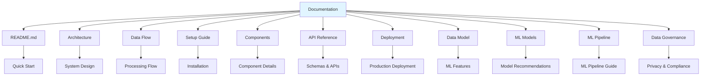

# Documentation Index

Welcome to the Media Publishing Real-Time Analytics Pipeline documentation.

## 📚 Documentation Structure

## 📖 Documentation Files

### [Architecture](./architecture.md)
Complete system architecture documentation with:
- High-level architecture diagrams
- Component architecture
- Data storage architecture
- Scalability and failure handling
- Security architecture

**Use this when**: Understanding the overall system design and how components interact.

### [Data Flow](./data-flow.md)
Detailed data flow documentation including:
- Complete data flow diagrams
- Event schema flow
- Aggregation flow
- Storage flow
- Real-time processing flow
- Error handling flow

**Use this when**: Understanding how data moves through the system and how events are processed.

### [Setup Guide](./setup.md)
Step-by-step setup instructions with:
- Prerequisites checklist
- Installation steps
- Configuration details
- Verification procedures
- Troubleshooting guide

**Use this when**: Setting up the pipeline for the first time or troubleshooting setup issues.

### [Components](./components.md)
Detailed component documentation covering:
- Kafka Producer architecture
- Spark Streaming pipeline
- MinIO data lake structure
- ClickHouse schema design
- Performance characteristics
- Scaling considerations

**Use this when**: Understanding individual components in detail or optimizing performance.

### [API Reference](./api-reference.md)
Complete API and schema reference including:
- Event schema structure
- ClickHouse schema
- Query examples
- Configuration reference
- Event types reference
- Data types mapping

**Use this when**: Integrating with the system or writing queries.

### [Deployment](./deployment.md)
Production deployment guide with:
- Production architecture
- Deployment steps
- Monitoring setup
- Scaling strategies
- Backup and recovery
- Performance tuning
- Security configuration

**Use this when**: Deploying to production or planning production architecture.

### [Data Model](./data-model.md)
ML-ready data model documentation including:
- ML-ready data model structure
- Feature engineering pipeline
- Feature categories (User, Session, Content, Engagement)
- Quick ML feature extraction queries
- ML use cases (Churn, Recommendation, Conversion, Segmentation)
- Feature store structure
- Real-time feature extraction
- Model training data pipeline
- Best practices for ML

**Use this when**: Building ML models, extracting features, or setting up ML pipelines.

### [ML Models](./ml-models.md)
ML model recommendations and architectures including:
- Model recommendations for each use case
- Churn prediction (XGBoost/LightGBM)
- Content recommendation (Hybrid: Matrix Factorization + Deep Learning)
- Subscription conversion (LightGBM)
- User segmentation (K-Means + PCA)
- Click prediction (Wide & Deep Neural Network)
- Engagement prediction (LSTM + Gradient Boosting)
- Ad revenue optimization (Thompson Sampling)
- Model comparison matrix
- Real-time ML pipeline architecture
- Deployment strategy

**Use this when**: Selecting ML models, understanding model architecture, or deploying ML solutions.

### [ML Pipeline](./ml-pipeline.md)
Complete ML pipeline documentation including:
- Data exploration process
- Feature engineering pipeline
- Model implementations (all 8 models)
- Model evaluation metrics
- Model deployment guidelines
- Best practices and troubleshooting
- Quick reference commands

**Use this when**: Implementing ML models, understanding the ML workflow, or troubleshooting ML issues.

### [Data Governance](./data-governance.md)
Comprehensive data governance framework including:
- Privacy & compliance (GDPR)
- Data quality framework
- Access control (RBAC)
- Data lifecycle management
- Audit & monitoring
- Compliance reporting

**Use this when**: Understanding data governance policies, compliance requirements, privacy controls, or implementing data governance practices.

## 🚀 Quick Navigation

### For Developers
1. Start with [Setup Guide](./setup.md)
2. Review [Architecture](./architecture.md)
3. Check [API Reference](./api-reference.md)

### For Architects
1. Review [Architecture](./architecture.md)
2. Study [Data Flow](./data-flow.md)
3. Check [Components](./components.md)

### For ML Engineers
1. Start with [Data Model](./data-model.md) for feature extraction
2. Review [ML Pipeline](./ml-pipeline.md) for implementation guide
3. Check [ML Models](./ml-models.md) for model recommendations
4. Review [API Reference](./api-reference.md) for schemas
5. Review [Data Flow](./data-flow.md) for data sources

### For DevOps
1. Review [Deployment](./deployment.md)
2. Check [Setup Guide](./setup.md)
3. Review [Components](./components.md) for configuration

## 📊 Visual Guides

All documentation includes Mermaid diagrams for:
- Architecture diagrams
- Sequence diagrams
- Flowcharts
- Entity-relationship diagrams
- State diagrams

## 🔍 Search Tips

- **Architecture**: Use [architecture.md](./architecture.md)
- **How data flows**: Use [data-flow.md](./data-flow.md)
- **Setup issues**: Use [setup.md](./setup.md)
- **Component details**: Use [components.md](./components.md)
- **API/Schema**: Use [api-reference.md](./api-reference.md)
- **Production**: Use [deployment.md](./deployment.md)
- **ML Features**: Use [data-model.md](./data-model.md)
- **ML Models**: Use [ml-models.md](./ml-models.md)
- **ML Pipeline**: Use [ml-pipeline.md](./ml-pipeline.md)

## 📝 Contributing

When updating documentation:
1. Keep Mermaid diagrams updated
2. Maintain consistency across files
3. Update this index if adding new files
4. Include examples where relevant

## 🔗 Related Resources

- Main [README.md](../README.md)
- Source code: `kafka_producer.py`, `spark_streaming.py`
- Configuration: `docker-compose.yml`, `clickhouse/init.sql`

