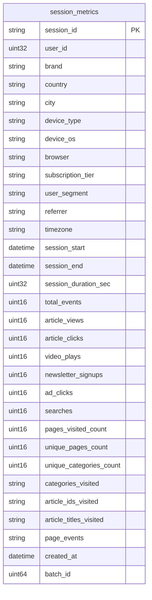
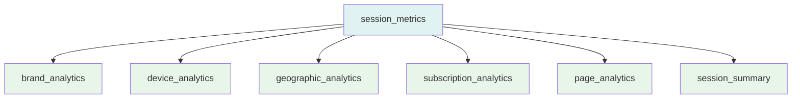
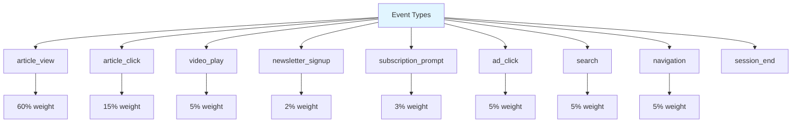
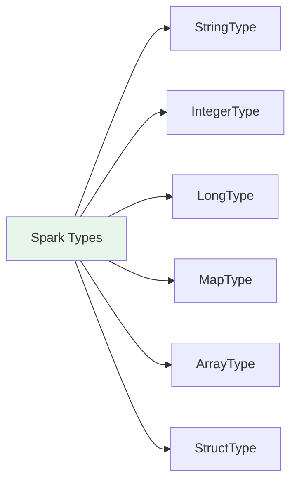

# API Reference

## Event Schema

### UserEvent Structure

```mermaid
graph TB
    A[UserEvent] --> B[Core Fields]
    A --> C[Content Fields]
    A --> D[Device Fields]
    A --> E[Geographic Fields]
    A --> F[Engagement Fields]
    A --> G[Metadata Fields]
    
    B --> B1[event_id: UUID]
    B --> B2[user_id: Integer]
    B --> B3[session_id: UUID]
    B --> B4[event_type: String]
    B --> B5[timestamp: Long]
    
    C --> C1[brand: String]
    C --> C2[category: String]
    C --> C3[article_id: String]
    C --> C4[article_title: String]
    C --> C5[article_type: String]
    C --> C6[page_url: String]
    
    D --> D1[device_type: String]
    D --> D2[device_os: String]
    D --> D3[browser: String]
    
    E --> E1[country: String]
    E --> E2[city: String]
    E --> E3[timezone: String]
    
    F --> F1[engagement_metrics: Map]
    F --> F2[scroll_depth: Integer]
    F --> F3[time_on_page: Integer]
    F --> F4[read_progress: Integer]
    
    G --> G1[metadata: Map]
    G --> G2[session_start_time: Long]
    G --> G3[session_duration: Integer]
    G --> G4[articles_in_session: Integer]
    
    style A fill:#e1f5ff
```



### JSON Example

```json
{
  "event_id": "550e8400-e29b-41d4-a716-446655440000",
  "user_id": 123,
  "session_id": "26223370-4461-4c99-8dcc-766e517c8df6",
  "event_type": "article_view",
  "timestamp": 1699228800,
  "brand": "welt",
  "category": "politics",
  "article_id": "welt_politics_1234_1699228800",
  "article_title": "Breaking: Major Policy Shift Announced",
  "article_type": "news",
  "page_url": "https://welt.com/politics/welt_politics_1234_1699228800",
  "referrer": "google",
  "device_type": "desktop",
  "device_os": "Windows",
  "browser": "Chrome",
  "country": "DE",
  "city": "Berlin",
  "timezone": "Europe/Berlin",
  "subscription_tier": "premium",
  "user_segment": "engaged",
  "engagement_metrics": {
    "scroll_depth": 75,
    "time_on_page": 120,
    "read_progress": 60,
    "is_article_complete": false
  },
  "metadata": {
    "session_start_time": 1699228700,
    "session_duration": 100,
    "articles_in_session": 3,
    "is_new_session": false,
    "screen_resolution": "1920x1080",
    "language": "de-DE"
  }
}
```

## ClickHouse Schema

### session_metrics Table



### Materialized Views



## Query Examples

### ClickHouse Queries

```sql
-- Total sessions by brand
SELECT brand, count() as total_sessions
FROM session_metrics
GROUP BY brand
ORDER BY total_sessions DESC;

-- Average session duration by device type
SELECT device_type, avg(session_duration_sec) as avg_duration
FROM session_metrics
GROUP BY device_type;

-- Top countries by sessions
SELECT country, count() as sessions
FROM session_metrics
GROUP BY country
ORDER BY sessions DESC
LIMIT 10;

-- Subscription tier analysis
SELECT subscription_tier, 
       count() as sessions,
       avg(session_duration_sec) as avg_duration,
       avg(total_events) as avg_events
FROM session_metrics
GROUP BY subscription_tier;
```

### MinIO/Delta Lake Queries

```python
# Read all batches
df = spark.read.format("delta").load("s3a://session-metrics/sessions/")

# Read specific batch
df = spark.read.format("delta").load("s3a://session-metrics/sessions/batch_1")

# Time travel query
df = spark.read.format("delta").option("versionAsOf", 0).load("s3a://session-metrics/sessions/")
```

## Configuration Reference

### Kafka Producer Configuration

```python
KafkaProducer(
    bootstrap_servers='localhost:9092',
    value_serializer=lambda v: json.dumps(v).encode('utf-8'),
    acks='all',  # Wait for all replicas
    retries=3,
    max_in_flight_requests_per_connection=1,
    enable_idempotence=True,
    compression_type='snappy'
)
```

### Spark Streaming Configuration

```python
SparkSession.builder \
    .appName("AxelSpringerRealTimeAnalytics") \
    .config("spark.jars.packages", 
            "org.apache.spark:spark-sql-kafka-0-10_2.12:3.4.1,"
            "org.apache.hadoop:hadoop-aws:3.3.4,"
            "io.delta:delta-core_2.12:2.4.0") \
    .config("spark.sql.extensions", "io.delta.sql.DeltaSparkSessionExtension") \
    .config("spark.sql.catalog.spark_catalog", "org.apache.spark.sql.delta.catalog.DeltaCatalog") \
    .getOrCreate()
```

### ClickHouse Connection

```python
Client(
    host="localhost",
    port=9002,
    database="analytics",
    user="default",
    password="clickhouse"
)
```

### MinIO Connection

```python
config = {
    "endpoint": "http://localhost:9000",
    "access_key": "minioadmin",
    "secret_key": "minioadmin",
    "path_style": True,
    "secure": False
}
```

## Event Types Reference



## Data Types

### Spark Schema Types



### ClickHouse Types

- **String**: Variable-length strings
- **UInt32**: 32-bit unsigned integers
- **UInt16**: 16-bit unsigned integers
- **UInt64**: 64-bit unsigned integers
- **DateTime**: Date and time values
- **Float32**: 32-bit floating point

