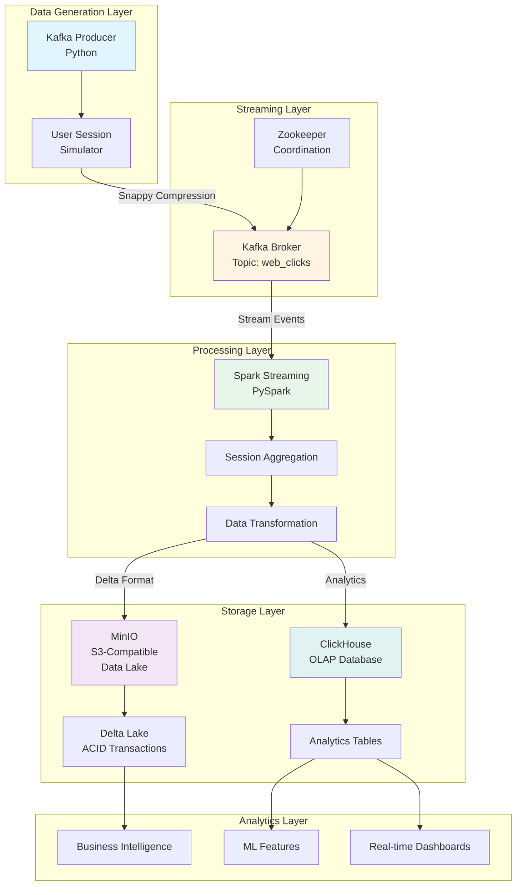
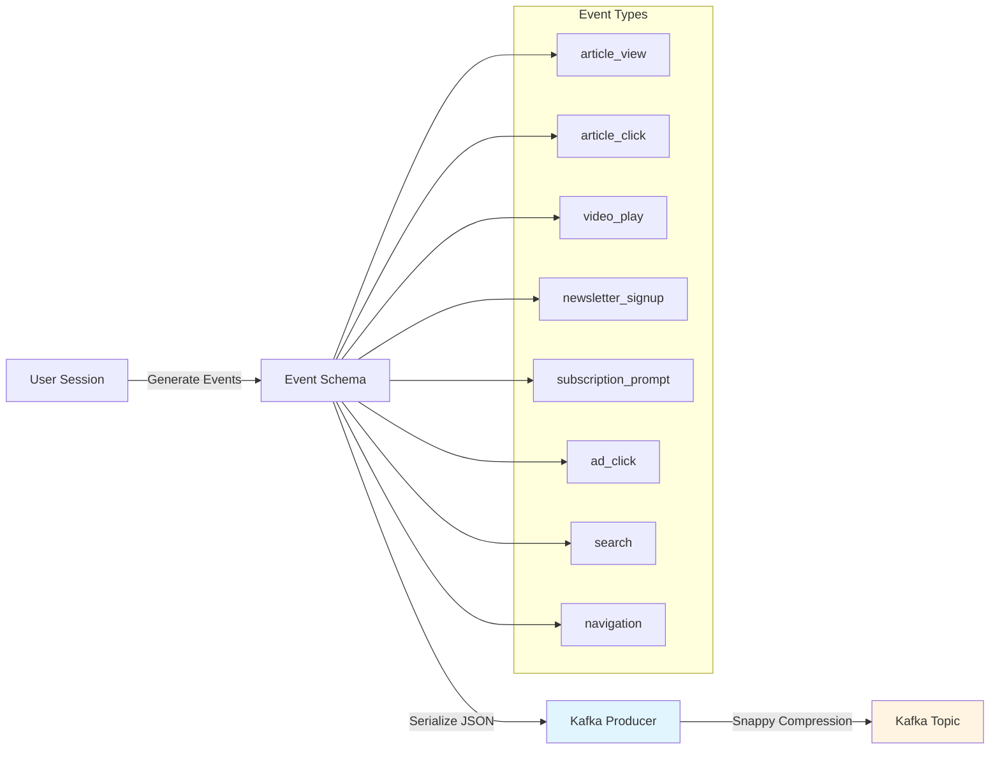
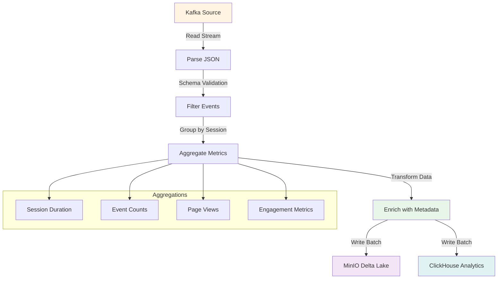
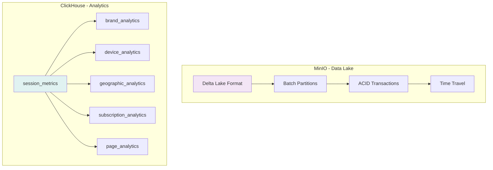
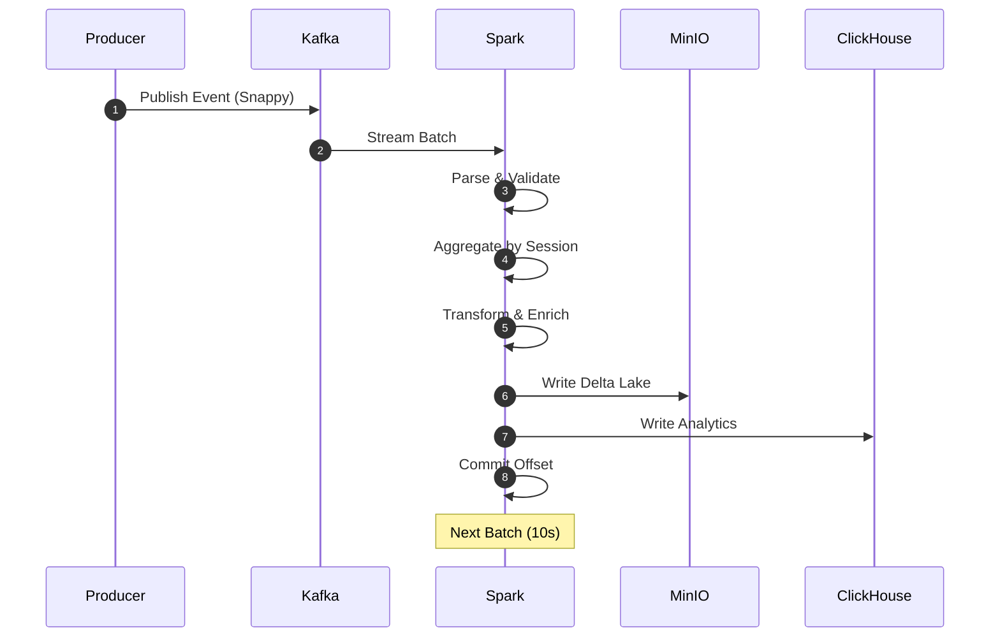
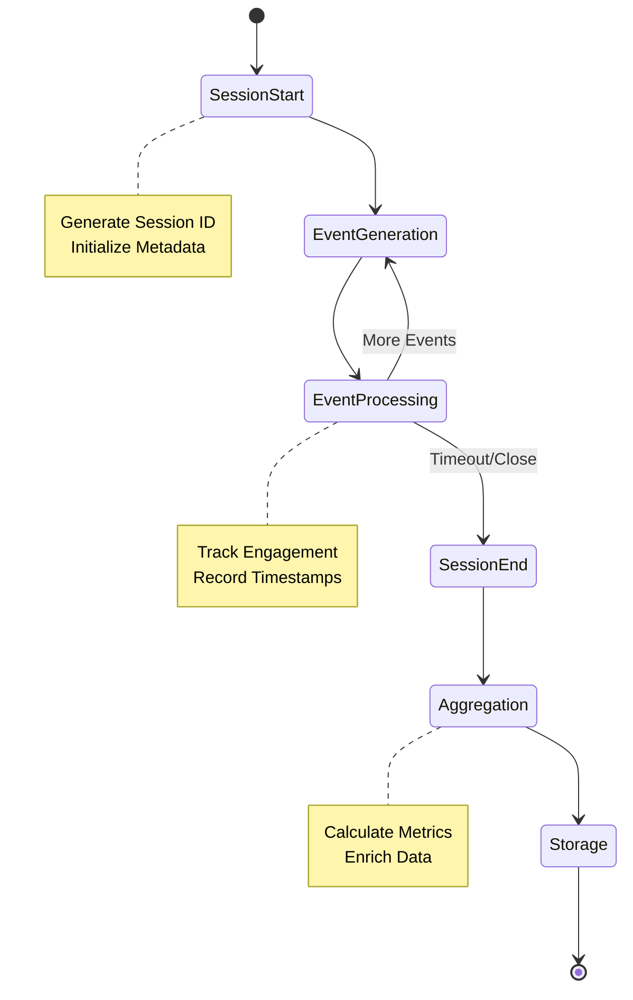
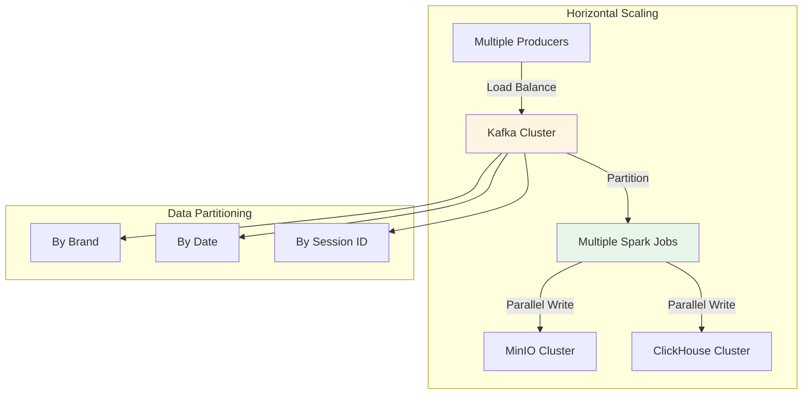
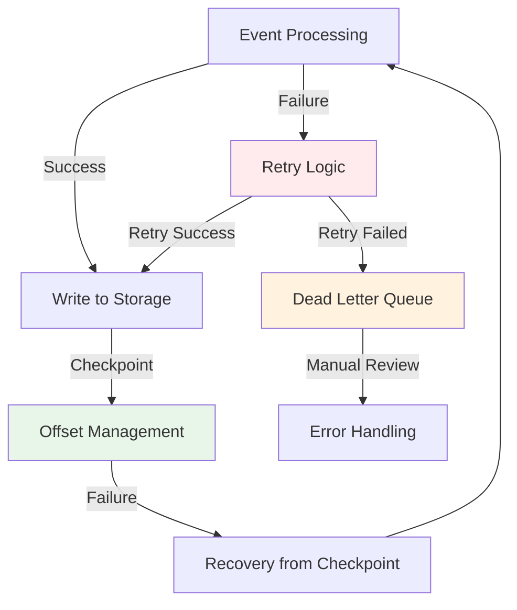
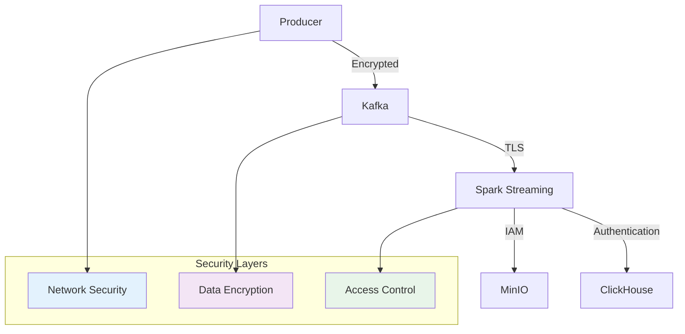

# System Architecture

## Overview

This document describes the architecture of the real-time analytics pipeline for Media Publishing's digital media properties.

## High-Level Architecture

## Component Architecture

### Kafka Producer

### Spark Streaming Pipeline

### Data Storage Architecture

## Data Flow Architecture

### Event Processing Flow

### Session Lifecycle

## Scalability Architecture

## Failure Handling

## Security Architecture

