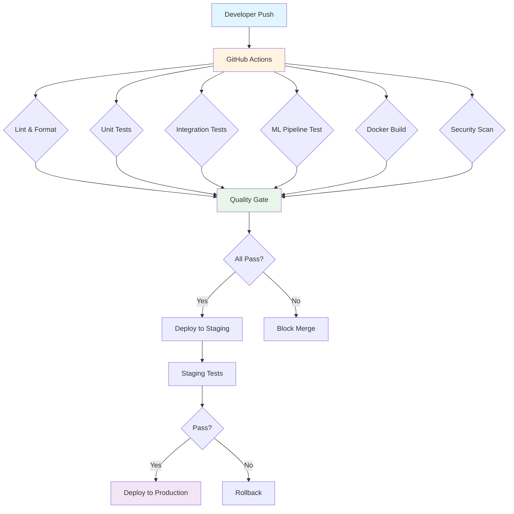

# CI/CD Pipeline Documentation

## Overview

The Media Publishing Analytics Platform implements a comprehensive CI/CD pipeline to ensure code quality, reliability, and automated deployment. This document describes the CI/CD architecture, workflows, and best practices.

## 🏗️ CI/CD Architecture



## 📋 CI/CD Workflows

### 1. Main CI Pipeline (`.github/workflows/ci.yml`)

**Triggers:**
- Push to `main`, `develop`, or `master` branches
- Pull requests to `main`, `develop`, or `master`
- Manual workflow dispatch

**Jobs:**

#### Lint and Format Check
- **Purpose**: Ensure code follows style guidelines
- **Tools**: Black, isort, Flake8, Pylint
- **Actions**:
  - Check code formatting with Black
  - Verify import sorting with isort
  - Run Flake8 linting for Python best practices
  - Run Pylint for additional code quality checks

#### Unit Tests
- **Purpose**: Validate individual components
- **Framework**: pytest with coverage
- **Coverage**: Minimum 80% code coverage
- **Output**: Coverage reports uploaded to Codecov

#### Integration Tests
- **Purpose**: Test component interactions
- **Services**: Kafka, ClickHouse, MinIO, Zookeeper
- **Tests**: End-to-end data flow validation

#### ML Pipeline Test
- **Purpose**: Validate ML model training
- **Environment**: ClickHouse for data storage
- **Validation**: Runs ML pipeline with test data

#### Docker Build
- **Purpose**: Validate Docker configurations
- **Action**: Build all Docker images from docker-compose.yml

#### Security Scan
- **Purpose**: Identify security vulnerabilities
- **Tool**: Bandit security linter
- **Output**: Security report in JSON and console

#### Code Quality Metrics
- **Purpose**: Measure code complexity and maintainability
- **Tools**: Radon (cyclomatic complexity, maintainability index)
- **Metrics**: Complexity scores, maintainability ratings

#### Deploy
- **Purpose**: Deploy to production (main/master only)
- **Condition**: All previous jobs must pass
- **Targets**: AWS EMR, Databricks, Kubernetes, Azure Synapse, GCP Dataproc

### 2. Data Quality Checks (`.github/workflows/data-quality.yml`)

**Triggers:**
- Daily at 2 AM UTC (cron schedule)
- Manual workflow dispatch

**Purpose**: 
- Validate data freshness
- Check data completeness
- Monitor data volume
- Detect anomalies

**Checks:**
- Latest session timestamp
- Null value counts
- Data volume trends
- Schema validation

### 3. ML Model Training (`.github/workflows/ml-training.yml`)

**Triggers:**
- Weekly on Sunday at 3 AM UTC
- Manual workflow dispatch with model selection

**Purpose**: 
- Retrain ML models with new data
- Track model versions
- Store model artifacts

**Actions:**
- Initialize ClickHouse with test data
- Run ML pipeline training
- Upload models to artifact storage
- Log metrics to MLflow (optional)

## 🛠️ Local Development

### Using Makefile

The project includes a `Makefile` with common CI/CD commands:

```bash
# Setup environment
make setup

# Run tests
make test

# Run linting
make lint

# Format code
make format

# Docker commands
make docker-up
make docker-down
make docker-logs

# CI-specific commands
make ci-test
make ci-lint
make ci-format-check

# Health checks
make health-check
```

### Manual CI Checks

Before pushing, run these checks locally:

```bash
# Format code
black kafka_producer.py spark_streaming.py run_ml.py ml/*.py
isort kafka_producer.py spark_streaming.py run_ml.py ml/*.py

# Run linting
flake8 . --max-line-length=127
pylint kafka_producer.py spark_streaming.py run_ml.py

# Run tests
pytest tests/ -v --cov=. --cov-report=html

# Check Docker
docker-compose build
docker-compose up -d
```

## 📊 CI/CD Metrics

### Code Quality Metrics

- **Cyclomatic Complexity**: < 10 per function
- **Maintainability Index**: > 70
- **Code Coverage**: > 80%
- **Code Duplication**: < 5%

### Performance Metrics

- **CI Pipeline Duration**: < 15 minutes
- **Test Execution Time**: < 10 minutes
- **Docker Build Time**: < 5 minutes

### Quality Gates

All checks must pass before merge:
- ✅ Linting (no errors)
- ✅ Formatting (consistent style)
- ✅ Unit tests (all passing)
- ✅ Integration tests (all passing)
- ✅ Security scan (no critical issues)
- ✅ Code coverage (> 80%)

## 🚀 Deployment Strategies

### Staging Deployment

1. **Trigger**: Merge to `develop` branch
2. **Process**:
   - Run full CI pipeline
   - Deploy to staging environment
   - Run smoke tests
   - Validate data pipeline

### Production Deployment

1. **Trigger**: Merge to `main` or `master` branch
2. **Process**:
   - Run full CI pipeline
   - Deploy to production
   - Monitor health metrics
   - Rollback on failure

### Deployment Targets

The platform supports deployment to multiple cloud platforms:

- **AWS**: EMR for Spark, Glue for orchestration
- **Azure**: Synapse Analytics, Databricks
- **GCP**: Dataproc, BigQuery
- **Kubernetes**: Spark on K8s, ClickHouse Operator

## 🔒 Security Best Practices

### Secret Management

- Use GitHub Secrets for sensitive data
- Never commit credentials to repository
- Rotate secrets regularly
- Use least-privilege access

### Security Scanning

- **Bandit**: Python security linter
- **Dependency Scanning**: Check for vulnerabilities
- **Container Scanning**: Docker image security
- **SAST**: Static Application Security Testing

### Compliance

- Follow OWASP Top 10 guidelines
- Implement data encryption at rest and in transit
- Regular security audits
- Access control and audit logging

## 📈 Monitoring and Alerting

### CI/CD Metrics Dashboard

- Build success rate
- Test execution time trends
- Code coverage trends
- Deployment frequency
- Mean time to recovery (MTTR)

### Alerts

- Build failures
- Test failures
- Security vulnerabilities
- Deployment failures
- Performance degradation

## 🐛 Troubleshooting

### Common Issues

#### CI Pipeline Fails on Linting
```bash
# Fix formatting
make format

# Check specific issues
flake8 <file> --show-source
```

#### Integration Tests Timeout
- Check service health: `make health-check`
- Verify Docker services are running
- Increase timeout in workflow file

#### Docker Build Fails
```bash
# Clean and rebuild
docker-compose down
docker-compose build --no-cache
docker-compose up -d
```

#### ML Pipeline Test Fails
- Verify ClickHouse is accessible
- Check data availability
- Review model training logs

## 📚 Additional Resources

- [GitHub Actions Documentation](https://docs.github.com/en/actions)
- [Pytest Documentation](https://docs.pytest.org/)
- [Black Code Style](https://black.readthedocs.io/)
- [Docker Compose Reference](https://docs.docker.com/compose/)

## 🔄 Continuous Improvement

### Regular Reviews

- Weekly CI/CD performance review
- Monthly security audit
- Quarterly architecture review
- Annual compliance review

### Optimization Opportunities

- Parallel test execution
- Caching dependencies
- Optimized Docker layers
- Incremental builds

---

*Last Updated: 2024*  
*Media Publishing Analytics Platform*

