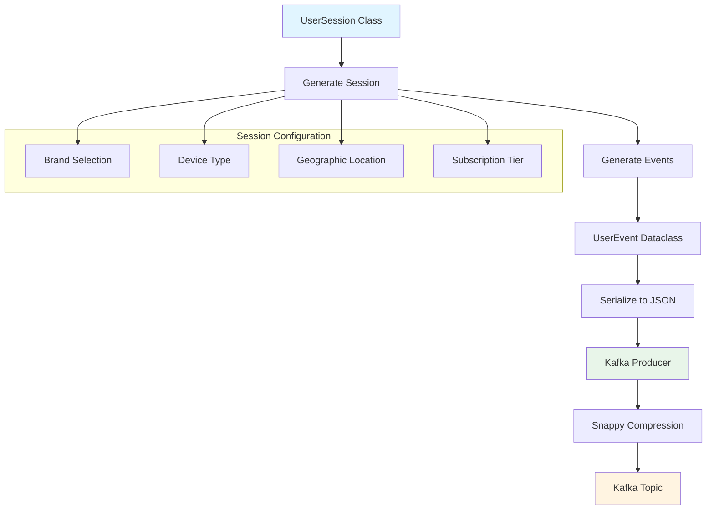
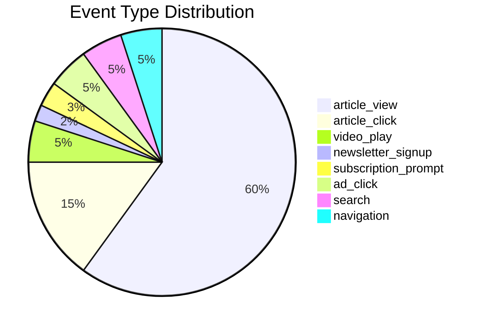
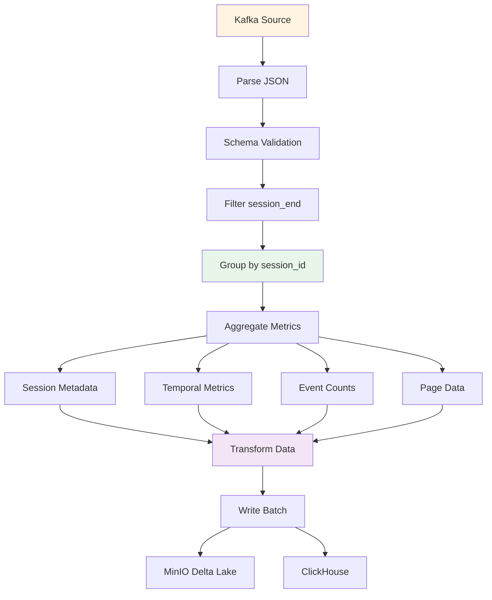
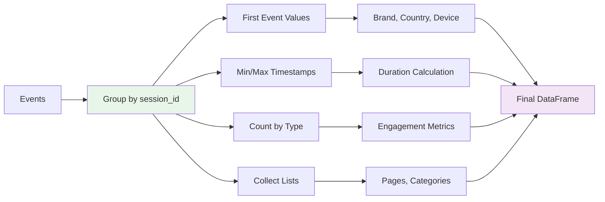
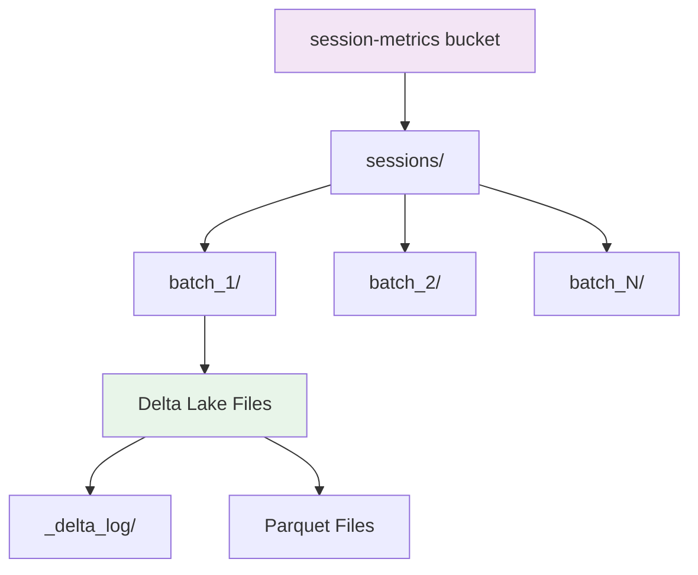
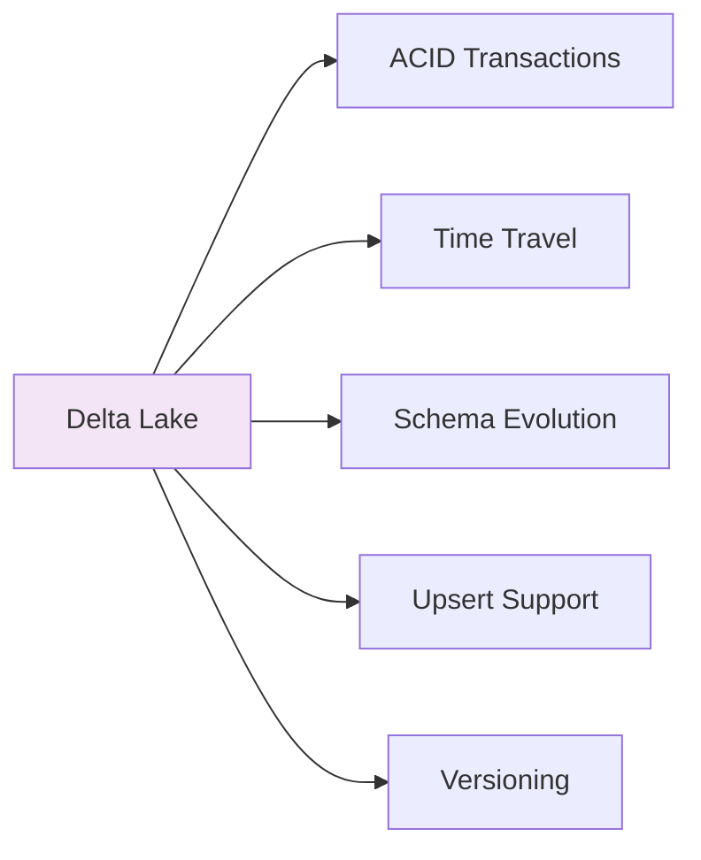
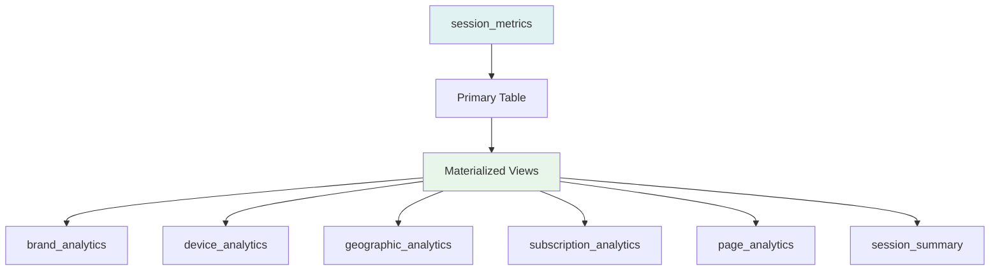
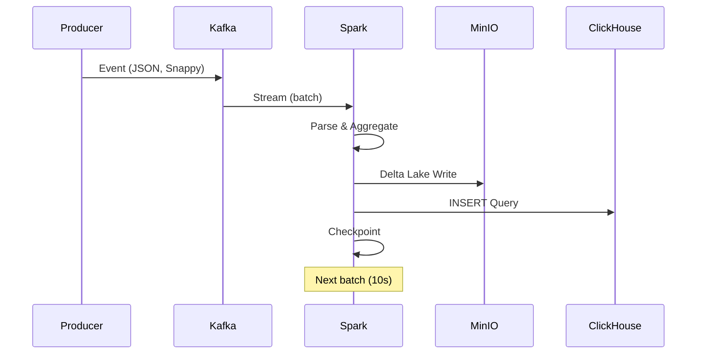
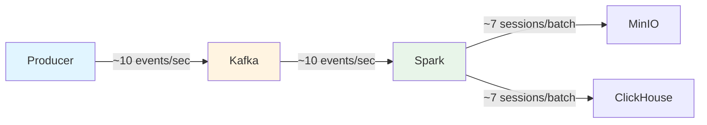
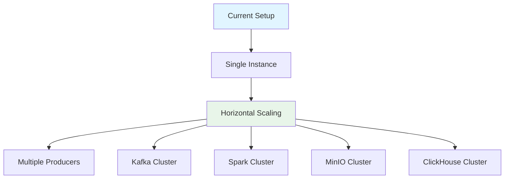

# Component Details

## Kafka Producer

### Architecture

### Configuration

- **Topic**: `web_clicks`
- **Compression**: Snappy
- **Acks**: `all` (wait for all replicas)
- **Idempotence**: Enabled
- **Retries**: 3

### Event Types

## Spark Streaming

### Processing Pipeline

### Aggregation Logic

### Configuration

- **App Name**: `AxelSpringerRealTimeAnalytics`
- **Checkpoint Location**: `/tmp/spark-checkpoints`
- **Trigger Interval**: 10 seconds
- **Output Mode**: `complete`
- **JARs**: Kafka, Hadoop-AWS, Delta Lake

## MinIO (Data Lake)

### Storage Structure

### Delta Lake Features

## ClickHouse

### Table Structure

### Schema Design

## Data Flow Between Components

## Performance Characteristics

### Throughput

### Latency

- **Producer → Kafka**: < 10ms
- **Kafka → Spark**: 10s (batch interval)
- **Spark Processing**: 1-2s
- **Storage Write**: 500ms-1s
- **Total End-to-End**: ~12-13s

## Scaling Considerations

