# Component Details

## Kafka Producer

### Architecture

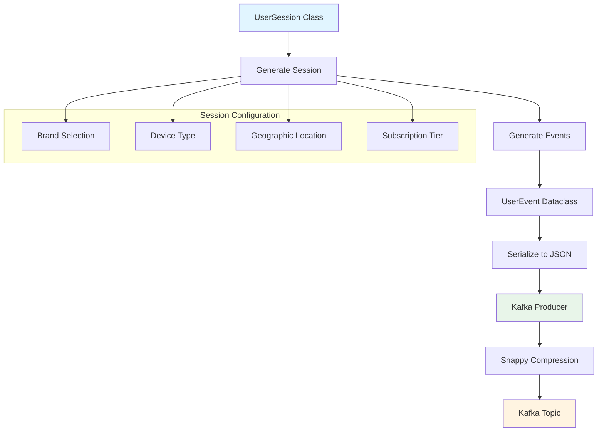

### Configuration

- **Topic**: `web_clicks`
- **Compression**: Snappy
- **Acks**: `all` (wait for all replicas)
- **Idempotence**: Enabled
- **Retries**: 3

### Event Types

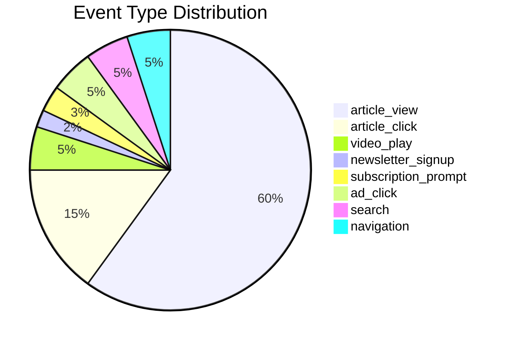

## Spark Streaming

### Processing Pipeline

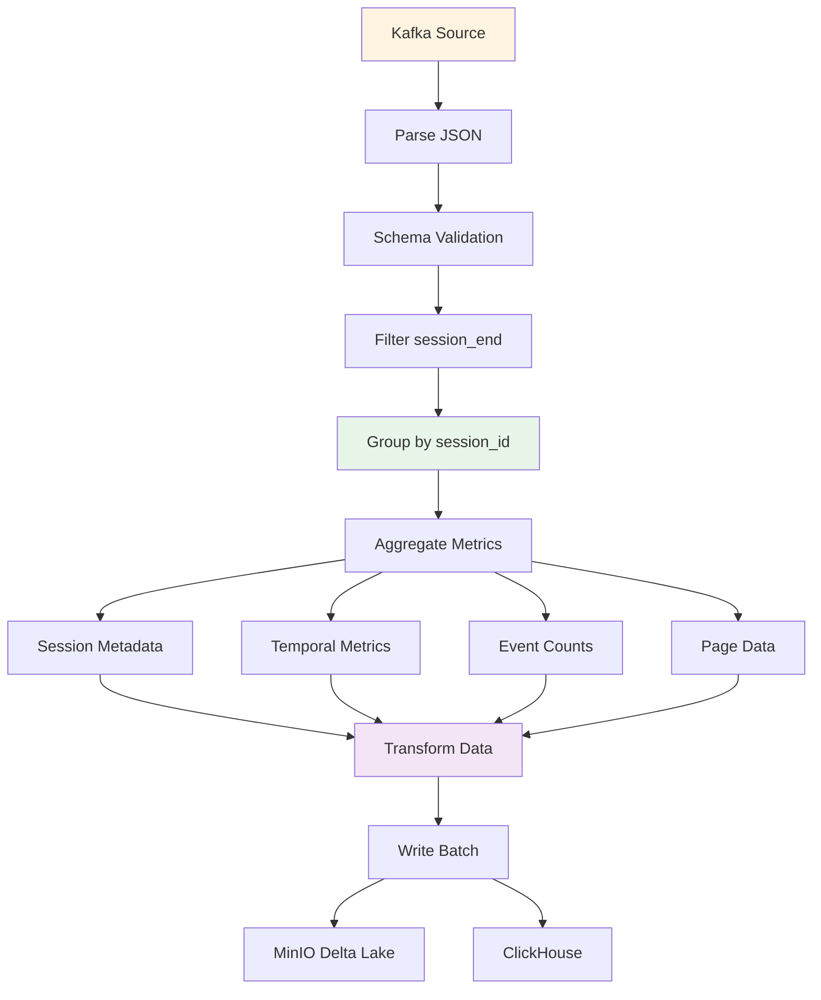

### Aggregation Logic

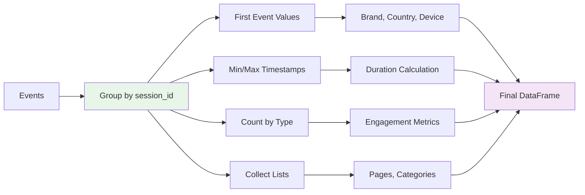

### Configuration

- **App Name**: `AxelSpringerRealTimeAnalytics`
- **Checkpoint Location**: `/tmp/spark-checkpoints`
- **Trigger Interval**: 10 seconds
- **Output Mode**: `complete`
- **JARs**: Kafka, Hadoop-AWS, Delta Lake

## MinIO (Data Lake)

### Storage Structure

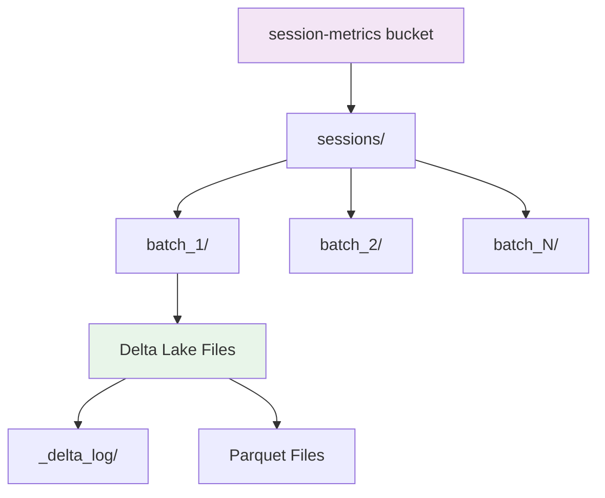

### Delta Lake Features

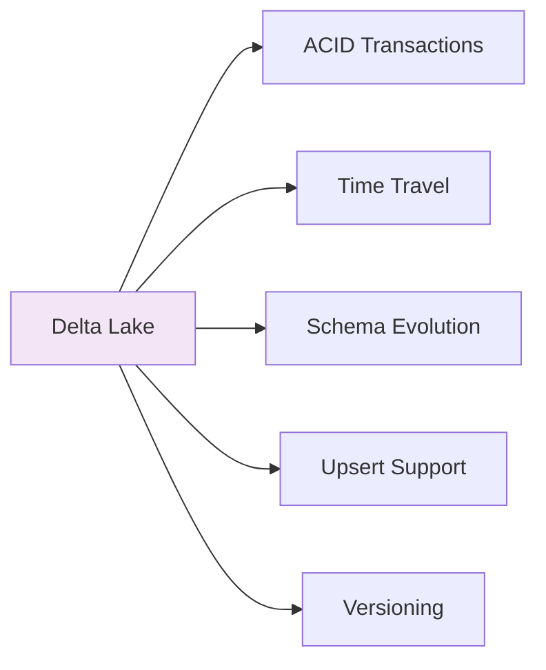

## ClickHouse

### Table Structure

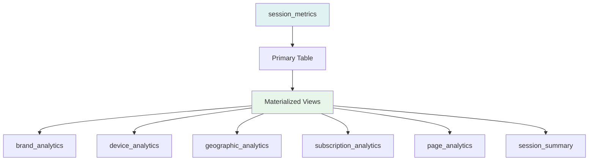

### Schema Design

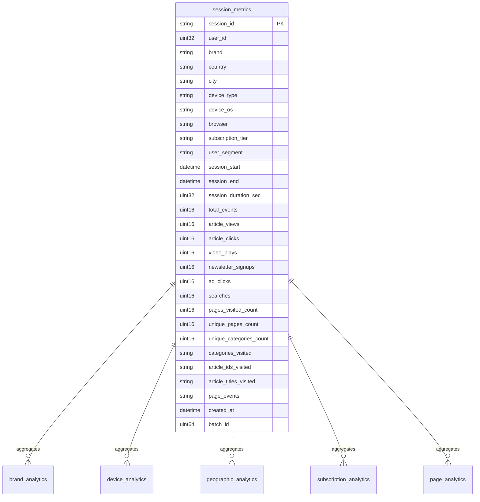

## Data Flow Between Components

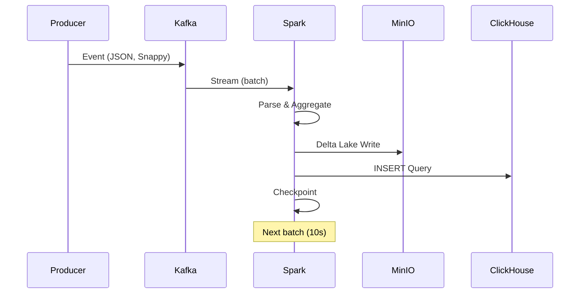

## Performance Characteristics

### Throughput

#### Current Setup (Development)

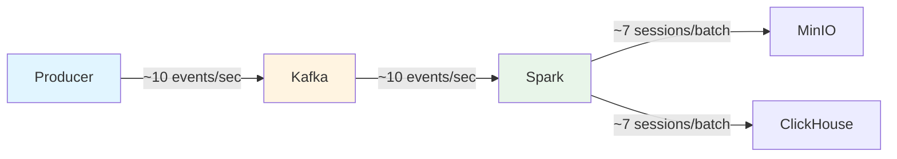

#### Production Scale (Terabyte-Level)

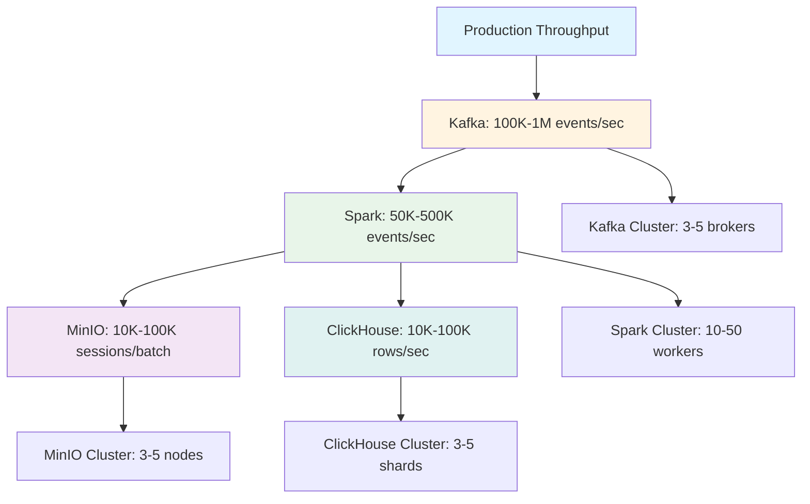

### Performance Benchmarks

#### Throughput Metrics

| Component | Development | Production (Single) | Production (Clustered) |
|-----------|-------------|---------------------|------------------------|
| **Kafka Producer** | 10 events/sec | 10K events/sec | 100K-1M events/sec |
| **Kafka Topic** | 10 events/sec | 10K events/sec | 100K-1M events/sec |
| **Spark Streaming** | 10 events/sec | 5K events/sec | 50K-500K events/sec |
| **Session Aggregation** | 7 sessions/batch | 1K sessions/batch | 10K-100K sessions/batch |
| **MinIO Write** | 7 sessions/batch | 1K sessions/batch | 10K-100K sessions/batch |
| **ClickHouse Write** | 7 rows/batch | 1K rows/batch | 10K-100K rows/sec |
| **ClickHouse Query** | < 100ms | < 500ms | < 2s (complex queries) |

#### Latency Metrics

| Stage | Development | Production (P50) | Production (P99) |
|-------|-------------|-------------------|------------------|
| **Producer → Kafka** | < 10ms | < 5ms | < 20ms |
| **Kafka → Spark** | 10s (batch) | 10s (batch) | 10s (batch) |
| **Spark Processing** | 1-2s | 2-5s | 10-30s |
| **MinIO Write** | 500ms-1s | 1-3s | 5-10s |
| **ClickHouse Write** | 200-500ms | 500ms-2s | 3-8s |
| **Total End-to-End** | ~12-13s | ~15-20s | ~30-50s |

#### Data Volume Benchmarks

| Metric | Development | Production (Daily) | Production (Monthly) |
|--------|-------------|-------------------|----------------------|
| **Events Processed** | ~864K/day | 1B-10B/day | 30B-300B/month |
| **Sessions Created** | ~60K/day | 10M-100M/day | 300M-3B/month |
| **Data Stored (MinIO)** | ~100MB/day | 10-100GB/day | 300GB-3TB/month |
| **Data Stored (ClickHouse)** | ~50MB/day | 5-50GB/day | 150GB-1.5TB/month |
| **Query Volume** | < 100/day | 10K-100K/day | 300K-3M/month |

#### Resource Utilization

| Component | CPU | Memory | Storage | Network |
|-----------|-----|--------|---------|---------|
| **Kafka Producer** | 5-10% | 100-200MB | - | 1-10 Mbps |
| **Kafka Broker** | 10-20% | 1-2GB | 10-100GB | 10-100 Mbps |
| **Spark Streaming** | 20-40% | 2-4GB | - | 10-100 Mbps |
| **MinIO** | 5-15% | 500MB-1GB | 100GB-10TB | 10-100 Mbps |
| **ClickHouse** | 15-30% | 2-8GB | 50GB-5TB | 10-100 Mbps |

#### Production Scale (Terabyte-Level)

**Configuration:**
- **Kafka Cluster**: 3-5 brokers, 10-20 partitions per topic
- **Spark Cluster**: 10-50 workers, 4-8 cores, 8-16GB RAM per worker
- **MinIO Cluster**: 3-5 nodes, distributed mode
- **ClickHouse Cluster**: 3-5 shards, 2-3 replicas

**Performance Targets:**
- **Throughput**: 100K-1M events/second
- **Latency**: < 20s end-to-end (P99)
- **Storage**: 1-10TB per month
- **Query Performance**: < 2s for complex analytics queries
- **Availability**: 99.9% uptime

#### Cost Optimization

| Strategy | Impact | Cost Savings |
|----------|--------|--------------|
| **Data Retention** | Reduce storage by 50% | 50% storage cost |
| **Compression** | Reduce storage by 70% | 70% storage cost |
| **Partitioning** | Improve query performance | 30% compute cost |
| **Caching** | Reduce query load | 40% compute cost |
| **Archival** | Move old data to cold storage | 80% storage cost |

### Latency Breakdown

#### End-to-End Latency Analysis

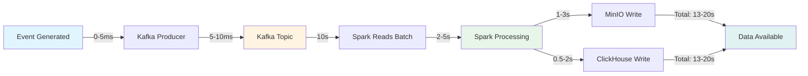

#### Latency Optimization

1. **Kafka Optimization**
   - Batch size: 32KB-64KB
   - Compression: Snappy (balanced)
   - Producer acks: `all` (reliability)

2. **Spark Optimization**
   - Batch interval: 10s (balance latency vs throughput)
   - Parallelism: Match partition count
   - Checkpointing: Every 5 batches

3. **Storage Optimization**
   - MinIO: Parallel writes
   - ClickHouse: Batch inserts (1000+ rows)
   - Connection pooling

### Scalability Metrics

#### Horizontal Scaling Impact

| Component | Scale Factor | Throughput Increase | Latency Impact |
|-----------|--------------|---------------------|----------------|
| **Kafka Brokers** | 1 → 3 | 2.5x | Minimal |
| **Spark Workers** | 1 → 10 | 8x | Minimal |
| **MinIO Nodes** | 1 → 3 | 2.5x | Minimal |
| **ClickHouse Shards** | 1 → 3 | 2.5x | Minimal |

#### Vertical Scaling Impact

| Component | Resource Increase | Throughput Increase | Cost Impact |
|-----------|-------------------|---------------------|-------------|
| **CPU** | 2x → 4x cores | 1.8x | 2x cost |
| **Memory** | 4GB → 8GB | 1.2x | 2x cost |
| **Storage** | 100GB → 500GB | N/A | 5x cost |

### Performance Monitoring

#### Key Performance Indicators (KPIs)

1. **Throughput KPIs**
   - Events processed per second
   - Sessions created per batch
   - Data written per second
   - Query throughput

2. **Latency KPIs**
   - End-to-end latency (P50, P95, P99)
   - Processing latency
   - Query latency
   - Storage write latency

3. **Resource KPIs**
   - CPU utilization
   - Memory utilization
   - Storage utilization
   - Network bandwidth

4. **Quality KPIs**
   - Error rate
   - Data quality score
   - Availability
   - Recovery time

### Benchmarking Methodology

#### Load Testing

1. **Baseline Test**
   - Single producer, single consumer
   - Measure baseline performance

2. **Scale Test**
   - Multiple producers, multiple consumers
   - Measure scaling impact

3. **Stress Test**
   - Peak load simulation
   - Measure system limits

4. **Endurance Test**
   - Long-running test (24+ hours)
   - Measure stability and memory leaks

#### Performance Tuning

1. **Identify Bottlenecks**
   - Monitor resource utilization
   - Analyze latency breakdown
   - Profile code execution

2. **Optimize Components**
   - Tune Kafka configurations
   - Optimize Spark jobs
   - Optimize storage writes

3. **Validate Improvements**
   - Re-run benchmarks
   - Compare before/after metrics
   - Document improvements

## Scaling Considerations

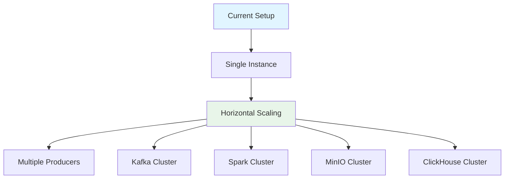

