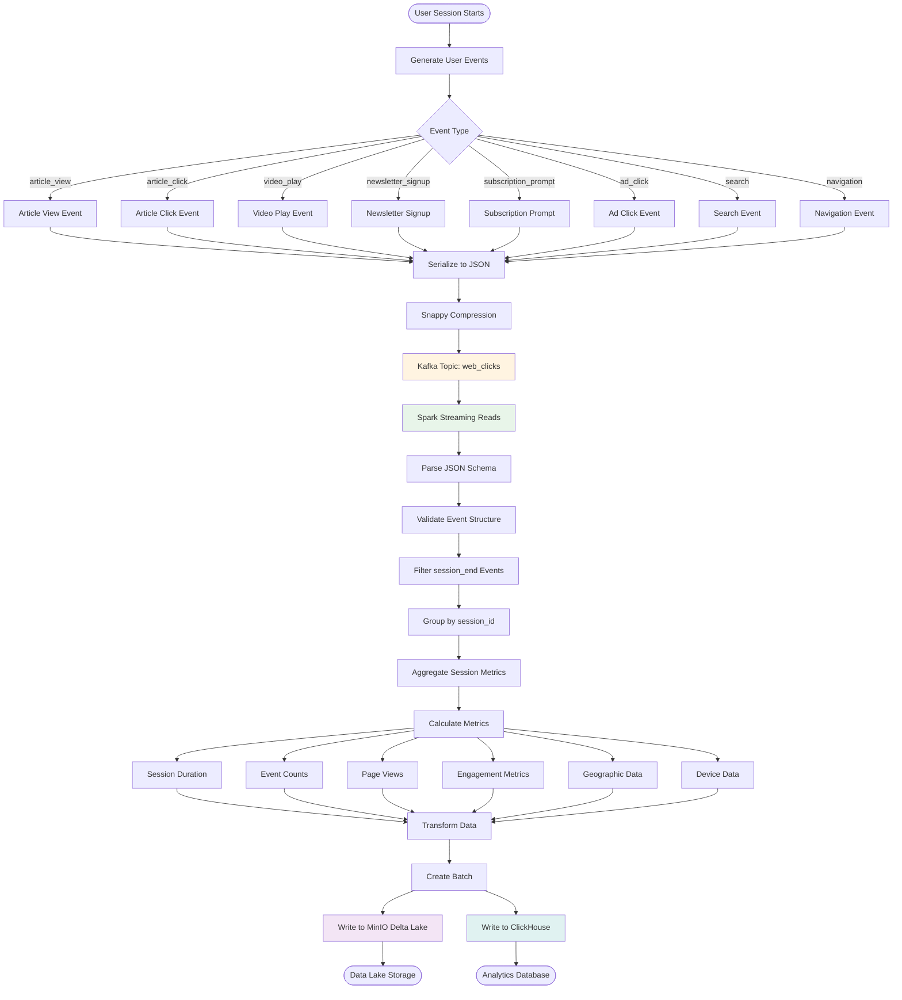
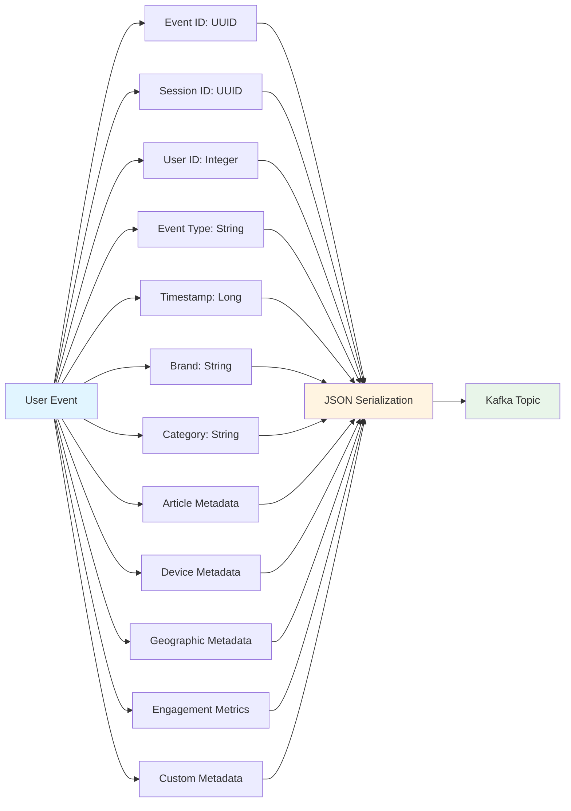
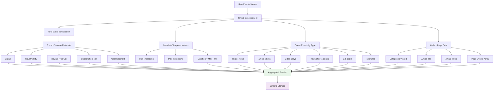
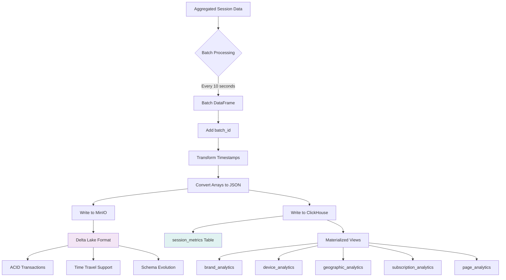
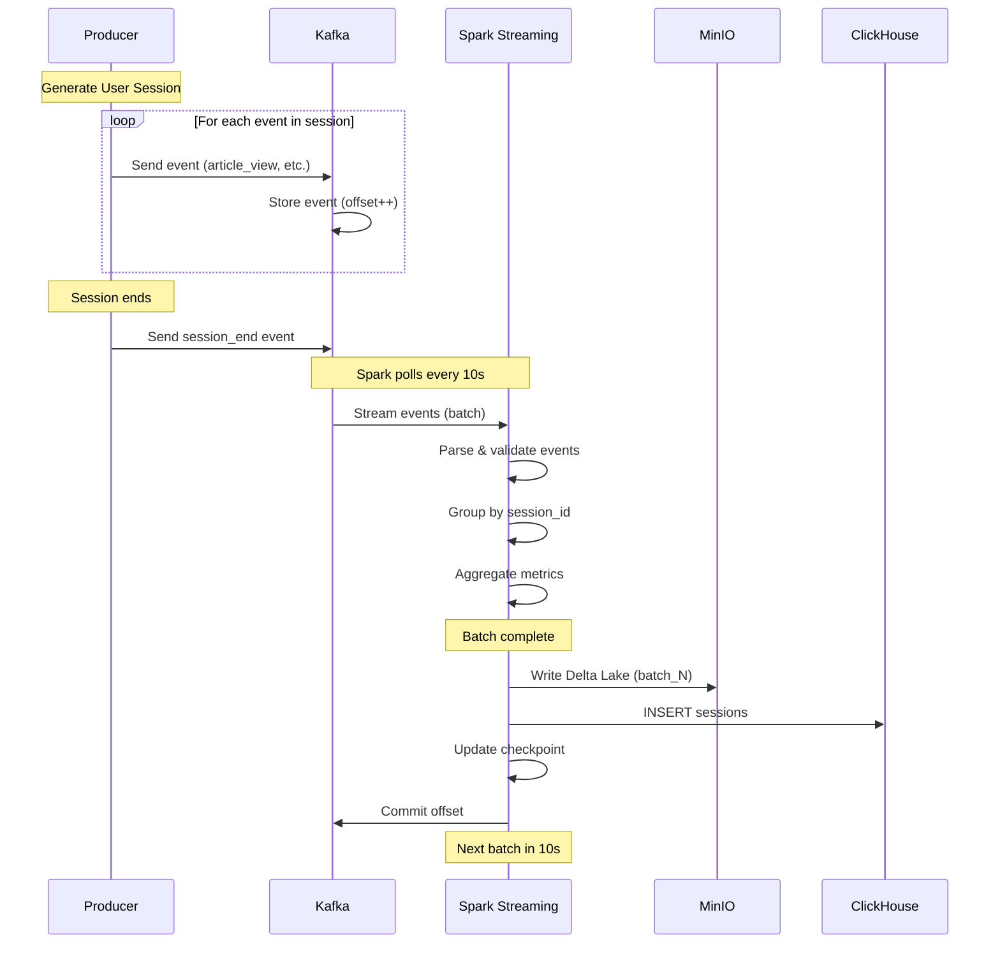
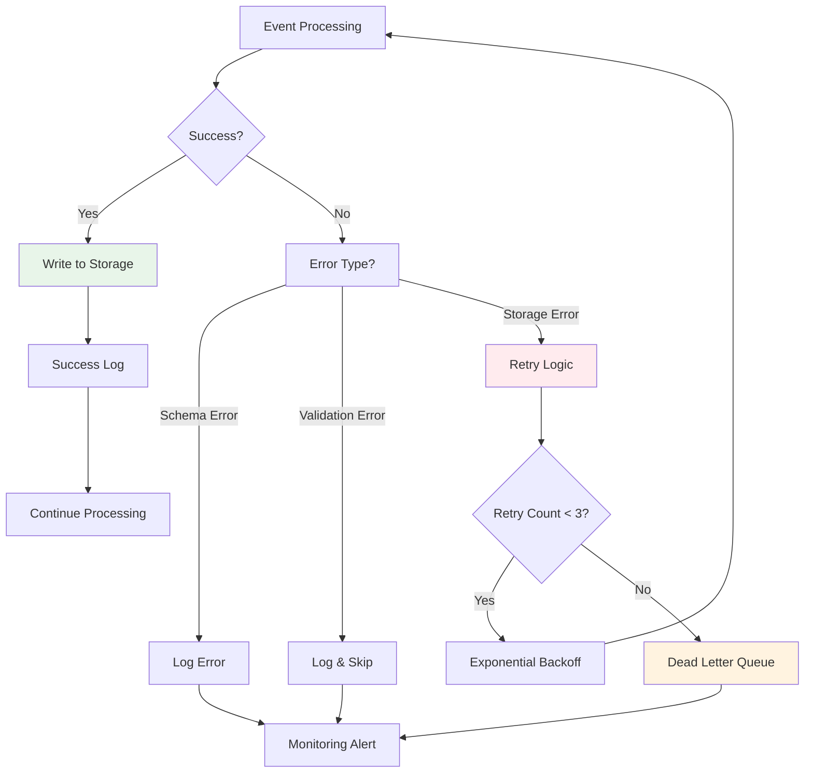

# Data Flow Documentation

## Complete Data Flow

```mermaid
flowchart TD
    Start([User Session Starts]) --> Gen[Generate User Events]
    Gen --> Event{Event Type}
    
    Event -->|article_view| A1[Article View Event]
    Event -->|article_click| A2[Article Click Event]
    Event -->|video_play| A3[Video Play Event]
    Event -->|newsletter_signup| A4[Newsletter Signup]
    Event -->|subscription_prompt| A5[Subscription Prompt]
    Event -->|ad_click| A6[Ad Click Event]
    Event -->|search| A7[Search Event]
    Event -->|navigation| A8[Navigation Event]
    
    A1 --> Serialize[Serialize to JSON]
    A2 --> Serialize
    A3 --> Serialize
    A4 --> Serialize
    A5 --> Serialize
    A6 --> Serialize
    A7 --> Serialize
    A8 --> Serialize
    
    Serialize --> Compress[Snappy Compression]
    Compress --> Kafka[Kafka Topic: web_clicks]
    
    Kafka --> Spark[Spark Streaming Reads]
    Spark --> Parse[Parse JSON Schema]
    Parse --> Validate[Validate Event Structure]
    Validate --> Filter[Filter session_end Events]
    
    Filter --> Group[Group by session_id]
    Group --> Aggregate[Aggregate Session Metrics]
    
    Aggregate --> Metrics[Calculate Metrics]
    Metrics --> M1[Session Duration]
    Metrics --> M2[Event Counts]
    Metrics --> M3[Page Views]
    Metrics --> M4[Engagement Metrics]
    Metrics --> M5[Geographic Data]
    Metrics --> M6[Device Data]
    
    M1 --> Transform[Transform Data]
    M2 --> Transform
    M3 --> Transform
    M4 --> Transform
    M5 --> Transform
    M6 --> Transform
    
    Transform --> Batch[Create Batch]
    Batch --> Delta[Write to MinIO Delta Lake]
    Batch --> CH[Write to ClickHouse]
    
    Delta --> End1([Data Lake Storage])
    CH --> End2([Analytics Database])
    
    style Kafka fill:#fff4e1
    style Spark fill:#e8f5e9
    style Delta fill:#f3e5f5
    style CH fill:#e0f2f1
```

## Event Schema Flow

```mermaid
graph LR
    A[User Event] --> B[Event ID: UUID]
    A --> C[Session ID: UUID]
    A --> D[User ID: Integer]
    A --> E[Event Type: String]
    A --> F[Timestamp: Long]
    A --> G[Brand: String]
    A --> H[Category: String]
    A --> I[Article Metadata]
    A --> J[Device Metadata]
    A --> K[Geographic Metadata]
    A --> L[Engagement Metrics]
    A --> M[Custom Metadata]
    
    B --> JSON[JSON Serialization]
    C --> JSON
    D --> JSON
    E --> JSON
    F --> JSON
    G --> JSON
    H --> JSON
    I --> JSON
    J --> JSON
    K --> JSON
    L --> JSON
    M --> JSON
    
    JSON --> Kafka[Kafka Topic]
    
    style A fill:#e1f5ff
    style JSON fill:#fff4e1
    style Kafka fill:#e8f5e9
```

## Aggregation Flow

```mermaid
flowchart TB
    A[Raw Events Stream] --> B[Group by session_id]
    B --> C[First Event per Session]
    C --> D[Extract Session Metadata]
    
    D --> E[Brand]
    D --> F[Country/City]
    D --> G[Device Type/OS]
    D --> H[Subscription Tier]
    D --> I[User Segment]
    
    B --> J[Calculate Temporal Metrics]
    J --> K[Min Timestamp]
    J --> L[Max Timestamp]
    J --> M[Duration = Max - Min]
    
    B --> N[Count Events by Type]
    N --> O[article_views]
    N --> P[article_clicks]
    N --> Q[video_plays]
    N --> R[newsletter_signups]
    N --> S[ad_clicks]
    N --> T[searches]
    
    B --> U[Collect Page Data]
    U --> V[Categories Visited]
    U --> W[Article IDs]
    U --> X[Article Titles]
    U --> Y[Page Events Array]
    
    E --> Z[Aggregated Session]
    F --> Z
    G --> Z
    H --> Z
    I --> Z
    M --> Z
    O --> Z
    P --> Z
    Q --> Z
    R --> Z
    S --> Z
    T --> Z
    V --> Z
    W --> Z
    X --> Z
    Y --> Z
    
    Z --> AA[Write to Storage]
    
    style Z fill:#e8f5e9
    style AA fill:#f3e5f5
```

## Storage Flow

```mermaid
graph TB
    A[Aggregated Session Data] --> B{Batch Processing}
    
    B -->|Every 10 seconds| C[Batch DataFrame]
    C --> D[Add batch_id]
    D --> E[Transform Timestamps]
    E --> F[Convert Arrays to JSON]
    
    F --> G[Write to MinIO]
    F --> H[Write to ClickHouse]
    
    G --> I[Delta Lake Format]
    I --> J[ACID Transactions]
    I --> K[Time Travel Support]
    I --> L[Schema Evolution]
    
    H --> M[session_metrics Table]
    H --> N[Materialized Views]
    
    N --> O[brand_analytics]
    N --> P[device_analytics]
    N --> Q[geographic_analytics]
    N --> R[subscription_analytics]
    N --> S[page_analytics]
    
    style I fill:#f3e5f5
    style M fill:#e0f2f1
```

## Real-time Processing Flow

```mermaid
sequenceDiagram
    participant P as Producer
    participant K as Kafka
    participant S as Spark Streaming
    participant M as MinIO
    participant C as ClickHouse
    
    Note over P: Generate User Session
    loop For each event in session
        P->>K: Send event (article_view, etc.)
        K->>K: Store event (offset++)
    end
    
    Note over P: Session ends
    P->>K: Send session_end event
    
    Note over K,S: Spark polls every 10s
    K->>S: Stream events (batch)
    S->>S: Parse & validate events
    S->>S: Group by session_id
    S->>S: Aggregate metrics
    
    Note over S: Batch complete
    S->>M: Write Delta Lake (batch_N)
    S->>C: INSERT sessions
    S->>S: Update checkpoint
    S->>K: Commit offset
    
    Note over S: Next batch in 10s
```

## Error Handling Flow

```mermaid
flowchart TD
    A[Event Processing] --> B{Success?}
    B -->|Yes| C[Write to Storage]
    B -->|No| D[Error Type?]
    
    D -->|Schema Error| E[Log Error]
    D -->|Validation Error| F[Log & Skip]
    D -->|Storage Error| G[Retry Logic]
    
    G --> H{Retry Count < 3?}
    H -->|Yes| I[Exponential Backoff]
    I --> A
    H -->|No| J[Dead Letter Queue]
    
    E --> K[Monitoring Alert]
    F --> K
    J --> K
    
    C --> L[Success Log]
    L --> M[Continue Processing]
    
    style G fill:#ffebee
    style J fill:#fff3e0
    style C fill:#e8f5e9
```

