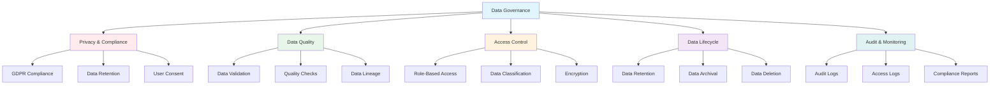
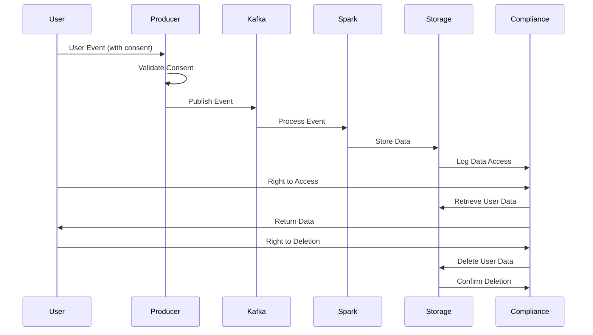
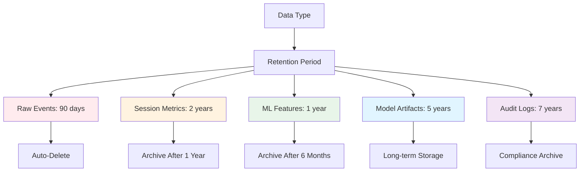
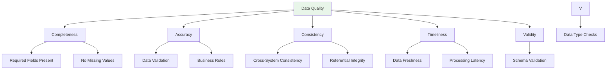
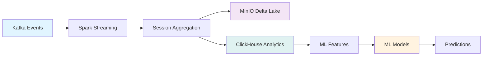
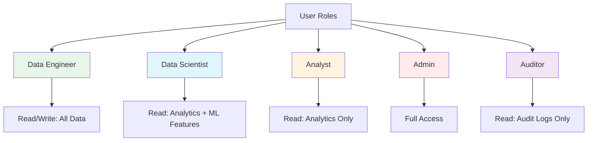
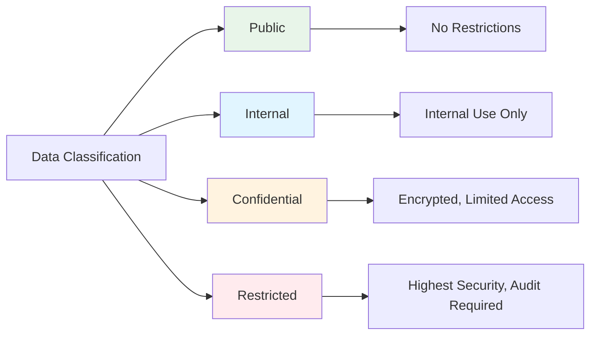
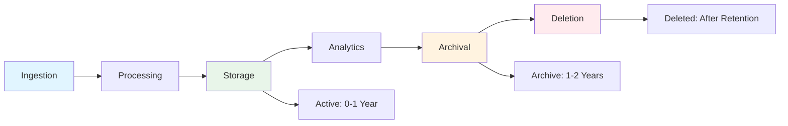
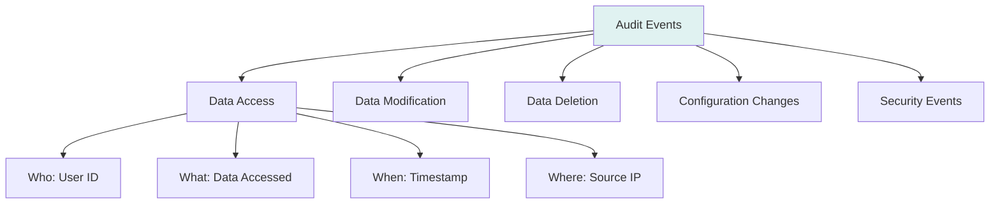

# Data Governance

## Overview

This document outlines the data governance framework for the Media Publishing real-time analytics pipeline, ensuring compliance, privacy, security, and data quality at scale.

## Governance Framework



## Privacy & Compliance

### GDPR Compliance



#### Key Principles

1. **Lawful Basis for Processing**
   - User consent for analytics
   - Legitimate interest for service improvement
   - Contractual necessity for subscription services

2. **Data Minimization**
   - Collect only necessary data
   - Anonymize where possible
   - Aggregate for analytics

3. **Purpose Limitation**
   - Data used only for stated purposes
   - No secondary use without consent
   - Clear documentation of use cases

4. **Storage Limitation**
   - Data retention policies enforced
   - Automatic deletion after retention period
   - Archival for compliance requirements

### Data Retention Policies



#### Retention Schedule

| Data Type | Retention Period | Archival | Deletion |
|-----------|----------------|----------|----------|
| Raw Kafka Events | 90 days | No | Automatic |
| Session Metrics (ClickHouse) | 2 years | After 1 year | After 2 years |
| ML Features | 1 year | After 6 months | After 1 year |
| Model Artifacts | 5 years | After 2 years | After 5 years |
| Audit Logs | 7 years | After 1 year | After 7 years |
| Delta Lake Data | 2 years | After 1 year | After 2 years |

### User Rights (GDPR)

#### Right to Access

```sql
-- Query user data from ClickHouse
SELECT *
FROM session_metrics
WHERE user_id = ?
ORDER BY session_start DESC
LIMIT 100;
```

#### Right to Deletion

```python
# Pseudo-code for data deletion
def delete_user_data(user_id: int):
    # 1. Delete from ClickHouse
    clickhouse.execute(f"DELETE FROM session_metrics WHERE user_id = {user_id}")
    
    # 2. Delete from MinIO (Delta Lake)
    spark.sql(f"DELETE FROM delta.`s3a://session-metrics/sessions/` WHERE user_id = {user_id}")
    
    # 3. Delete from Kafka (if still in retention)
    # Kafka retention handles this automatically
    
    # 4. Log deletion
    audit_log.log_deletion(user_id, datetime.now())
```

#### Right to Rectification

- Data correction procedures
- Update mechanisms for user data
- Validation of corrected data

#### Right to Portability

- Export user data in machine-readable format (JSON, CSV)
- API endpoints for data export
- Secure data transfer

## Data Quality

### Quality Framework



### Quality Checks

#### Automated Quality Checks

```python
# Daily data quality checks (from data-quality.yml workflow)
def check_data_quality():
    checks = {
        'freshness': check_data_freshness(),
        'completeness': check_data_completeness(),
        'accuracy': check_data_accuracy(),
        'volume': check_data_volume(),
        'anomalies': check_data_anomalies()
    }
    return checks
```

#### Quality Metrics

| Metric | Target | Alert Threshold |
|--------|--------|----------------|
| Data Freshness | < 1 hour | > 2 hours |
| Completeness | > 99% | < 95% |
| Accuracy | > 99.5% | < 99% |
| Processing Latency | < 15s | > 30s |
| Error Rate | < 0.1% | > 1% |

### Data Lineage



#### Lineage Tracking

- **Source**: Kafka topic `web_clicks`
- **Transformation**: Spark Streaming aggregation
- **Destination**: MinIO (Delta Lake) and ClickHouse
- **Derived Data**: ML features, model predictions
- **Metadata**: Timestamps, batch IDs, processing times

## Access Control

### Role-Based Access Control (RBAC)



### Access Levels

| Role | MinIO | ClickHouse | ML Models | Audit Logs |
|------|-------|------------|-----------|------------|
| Data Engineer | Read/Write | Read/Write | Read/Write | Read |
| Data Scientist | Read | Read/Write | Read/Write | Read |
| Analyst | Read | Read | Read | - |
| Admin | Full | Full | Full | Full |
| Auditor | - | - | - | Read |

### Data Classification



#### Classification Levels

- **Public**: Aggregated, anonymized statistics
- **Internal**: Session metrics, analytics (de-identified)
- **Confidential**: User-level data, ML features
- **Restricted**: Personal identifiers, sensitive attributes

## Data Lifecycle Management

### Lifecycle Stages



### Lifecycle Policies

#### Active Data (0-1 Year)
- **Location**: ClickHouse (hot storage)
- **Access**: Fast queries, real-time analytics
- **Cost**: Higher storage cost
- **Use Case**: Current analytics, ML training

#### Archived Data (1-2 Years)
- **Location**: MinIO (cold storage)
- **Access**: Slower queries, batch processing
- **Cost**: Lower storage cost
- **Use Case**: Historical analysis, compliance

#### Deleted Data (After Retention)
- **Process**: Automated deletion
- **Verification**: Audit log confirmation
- **Backup**: Compliance archives (if required)

## Audit & Monitoring

### Audit Logging



### Audit Log Schema

```sql
CREATE TABLE audit_logs (
    log_id String,
    timestamp DateTime,
    user_id String,
    action String,  -- 'READ', 'WRITE', 'DELETE', 'EXPORT'
    resource_type String,  -- 'session_metrics', 'ml_features', etc.
    resource_id String,
    ip_address String,
    user_agent String,
    success Boolean,
    error_message String
) ENGINE = MergeTree()
ORDER BY (timestamp, user_id);
```

### Monitoring & Alerts

#### Key Metrics

- **Access Patterns**: Unusual access patterns
- **Data Volume**: Unexpected data volume changes
- **Error Rates**: Increased error rates
- **Compliance**: Retention policy violations
- **Security**: Failed authentication attempts

#### Alert Thresholds

| Metric | Warning | Critical |
|--------|---------|----------|
| Failed Logins | > 5/hour | > 20/hour |
| Unusual Access | > 3 std dev | > 5 std dev |
| Data Volume Drop | > 20% | > 50% |
| Retention Violation | Any | Multiple |

## Compliance Reporting

### Regular Reports

1. **Monthly Compliance Report**
   - Data retention compliance
   - Access control audit
   - Data quality metrics
   - Security incidents

2. **Quarterly Privacy Report**
   - User data requests (access, deletion)
   - Consent management
   - Data breach incidents (if any)
   - Privacy impact assessments

3. **Annual Audit Report**
   - Full system audit
   - Compliance certification
   - Policy review and updates
   - Training and awareness

### Compliance Checklist

- [ ] GDPR compliance verified
- [ ] Data retention policies enforced
- [ ] Access controls implemented
- [ ] Audit logging active
- [ ] Data quality checks automated
- [ ] Privacy policies documented
- [ ] User rights procedures defined
- [ ] Security measures in place
- [ ] Regular compliance reviews scheduled
- [ ] Staff training completed

## Implementation

### Data Governance Tools

1. **Data Catalog**: Track data assets, lineage, metadata
2. **Access Management**: RBAC implementation
3. **Audit Logging**: Comprehensive audit trail
4. **Data Quality**: Automated quality checks
5. **Compliance Monitoring**: Automated compliance checks

### Best Practices

1. **Privacy by Design**: Build privacy into architecture
2. **Data Minimization**: Collect only necessary data
3. **Transparency**: Clear documentation of data usage
4. **Accountability**: Regular audits and reviews
5. **Continuous Improvement**: Regular policy updates

## References

- [GDPR Compliance Guide](https://gdpr.eu/)
- [Data Governance Framework](https://www.dama.org/)
- [Privacy by Design Principles](https://www.ipc.on.ca/privacy/privacy-by-design/)

