# Data Model for Machine Learning

## Overview

This document describes the data model optimized for machine learning use cases, including feature engineering, model training, and real-time inference.

## ML-Ready Data Model

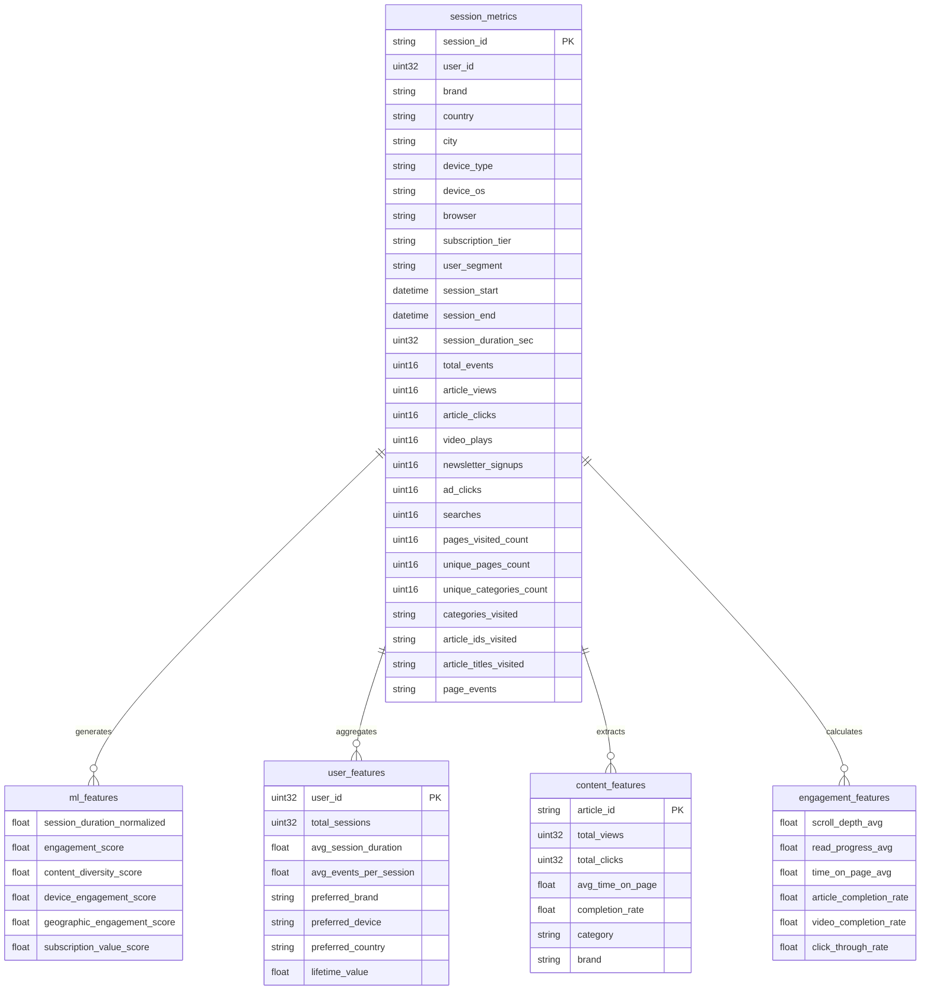

## Feature Engineering Pipeline

```mermaid
flowchart TD
    A[Raw Session Data] --> B[Feature Extraction]
    
    B --> C[User Features]
    B --> D[Session Features]
    B --> E[Content Features]
    B --> F[Engagement Features]
    B --> G[Behavioral Features]
    
    C --> C1[User ID]
    C --> C2[Total Sessions]
    C --> C3[Average Duration]
    C --> C4[Preferred Brand]
    C --> C5[Subscription Tier]
    
    D --> D1[Session Duration]
    D --> D2[Event Count]
    D --> D3[Pages Visited]
    D --> D4[Unique Categories]
    D --> D5[Time of Day]
    D --> D6[Day of Week]
    
    E --> E1[Article Views]
    E --> E2[Article Clicks]
    E --> E3[Video Plays]
    E --> E4[Categories Visited]
    E --> E5[Content Diversity]
    
    F --> F1[Scroll Depth]
    F --> F2[Read Progress]
    F --> F3[Time on Page]
    F --> F4[Completion Rate]
    
    G --> G1[Navigation Patterns]
    G --> G2[Search Behavior]
    G --> G3[Ad Interaction]
    G --> G4[Newsletter Signups]
    
    C1 --> H[ML Feature Vector]
    C2 --> H
    D1 --> H
    E1 --> H
    F1 --> H
    G1 --> H
    
    H --> I[Model Training]
    H --> J[Real-time Inference]
    
    style A fill:#e1f5ff
    style H fill:#e8f5e9
    style I fill:#f3e5f5
    style J fill:#fff4e1
```

## Feature Categories

### 1. User-Level Features

```mermaid
graph TB
    A[User Features] --> B[Demographics]
    A --> C[Behavioral]
    A --> D[Engagement]
    A --> E[Value]
    
    B --> B1[Country]
    B --> B2[City]
    B --> B3[Timezone]
    B --> B4[Device Type]
    B --> B5[Device OS]
    B --> B6[Browser]
    
    C --> C1[Total Sessions]
    C --> C2[Avg Session Duration]
    C --> C3[Preferred Brand]
    C --> C4[Preferred Category]
    C --> C5[Preferred Time]
    C --> C6[Session Frequency]
    
    D --> D1[Avg Events per Session]
    D --> D2[Avg Pages per Session]
    D --> D3[Engagement Score]
    D --> D4[Content Diversity]
    D --> D5[Video Engagement]
    
    E --> E1[Subscription Tier]
    E --> E2[User Segment]
    E --> E3[Newsletter Status]
    E --> E4[Ad Click Rate]
    E --> E5[Conversion Rate]
    
    style A fill:#e1f5ff
```

### 2. Session-Level Features

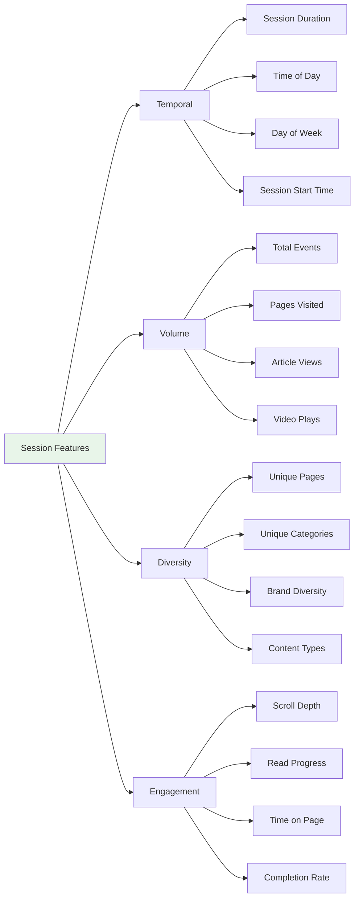

### 3. Content-Level Features

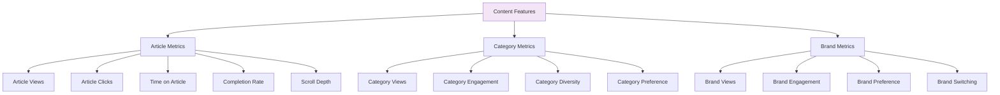

### 4. Engagement Features

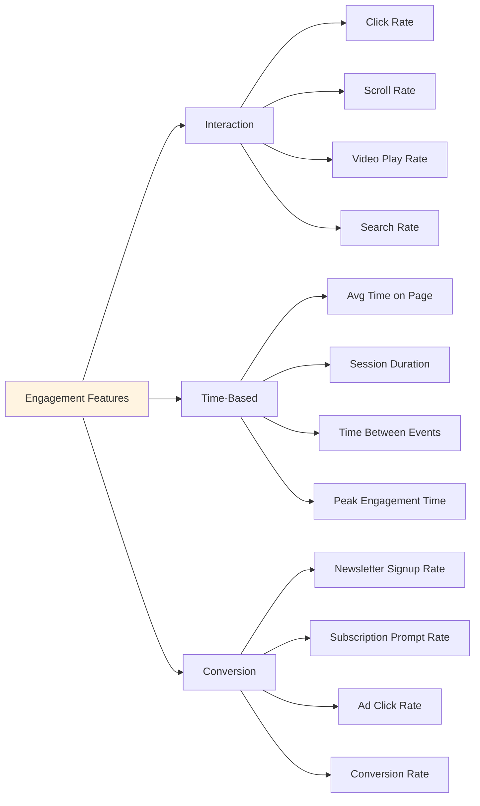

## Quick ML Feature Extraction

### Feature Extraction Queries

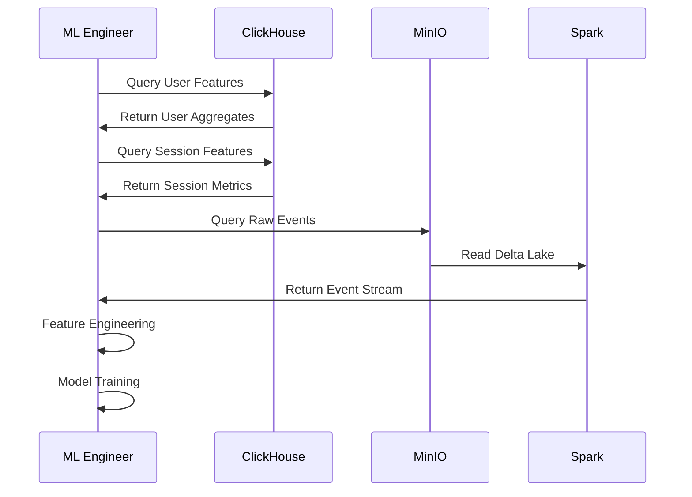

### ClickHouse Queries for ML

#### User-Level Features

```sql
-- User feature vector for ML
SELECT 
    user_id,
    -- Behavioral Features
    count() as total_sessions,
    avg(session_duration_sec) as avg_session_duration,
    avg(total_events) as avg_events_per_session,
    avg(pages_visited_count) as avg_pages_per_session,
    
    -- Engagement Features
    avg(article_views) as avg_article_views,
    avg(video_plays) as avg_video_plays,
    avg(newsletter_signups) as avg_newsletter_signups,
    sum(newsletter_signups) > 0 as has_newsletter,
    
    -- Diversity Features
    avg(unique_categories_count) as avg_categories_diversity,
    avg(unique_pages_count) as avg_pages_diversity,
    
    -- Value Features
    subscription_tier,
    user_segment,
    
    -- Geographic Features
    country,
    city,
    
    -- Device Features
    device_type,
    device_os,
    
    -- Brand Preference
    argMax(brand, session_start) as preferred_brand,
    countIf(brand = 'bild') as bild_sessions,
    countIf(brand = 'welt') as welt_sessions,
    countIf(brand = 'business_insider') as bi_sessions,
    countIf(brand = 'politico') as politico_sessions,
    countIf(brand = 'sport_bild') as sport_bild_sessions
    
FROM session_metrics
GROUP BY user_id, subscription_tier, user_segment, country, city, device_type, device_os
ORDER BY total_sessions DESC;
```

#### Session-Level Features

```sql
-- Session feature vector for ML
SELECT 
    session_id,
    user_id,
    
    -- Temporal Features
    session_duration_sec,
    toHour(session_start) as hour_of_day,
    toDayOfWeek(session_start) as day_of_week,
    toDate(session_start) as date,
    
    -- Volume Features
    total_events,
    pages_visited_count,
    unique_pages_count,
    unique_categories_count,
    
    -- Engagement Features
    article_views,
    article_clicks,
    video_plays,
    searches,
    ad_clicks,
    
    -- Calculated Features
    article_views * 1.0 / total_events as article_view_ratio,
    article_clicks * 1.0 / total_events as click_ratio,
    video_plays * 1.0 / total_events as video_ratio,
    unique_categories_count * 1.0 / pages_visited_count as content_diversity,
    
    -- Conversion Features
    newsletter_signups,
    CASE WHEN newsletter_signups > 0 THEN 1 ELSE 0 END as converted,
    
    -- Brand Features
    brand,
    country,
    device_type,
    subscription_tier,
    user_segment
    
FROM session_metrics
ORDER BY session_start DESC;
```

#### Engagement Score Calculation

```sql
-- Engagement score feature
SELECT 
    session_id,
    user_id,
    
    -- Base Engagement Score (0-100)
    (
        (article_views * 2) +
        (article_clicks * 3) +
        (video_plays * 5) +
        (newsletter_signups * 20) +
        (searches * 2) +
        (pages_visited_count * 1) +
        (unique_categories_count * 2)
    ) as engagement_score,
    
    -- Normalized Engagement Score
    (
        (article_views * 2.0 / total_events) +
        (article_clicks * 3.0 / total_events) +
        (video_plays * 5.0 / total_events) +
        (newsletter_signups * 20.0 / total_events)
    ) * 100 as normalized_engagement_score,
    
    -- Time-Based Engagement
    session_duration_sec / 60.0 as session_duration_minutes,
    total_events / (session_duration_sec / 60.0) as events_per_minute,
    
    -- Content Engagement
    article_views * 1.0 / pages_visited_count as article_view_rate,
    article_clicks * 1.0 / article_views as click_through_rate
    
FROM session_metrics
ORDER BY engagement_score DESC;
```

### Spark Feature Engineering

```python
# Feature engineering in Spark
from pyspark.sql import functions as F
from pyspark.sql.types import *

# Read session data
df = spark.read.format("delta").load("s3a://session-metrics/sessions/")

# Create ML features
ml_features = df.withColumn(
    "engagement_score",
    (F.col("article_views") * 2) +
    (F.col("article_clicks") * 3) +
    (F.col("video_plays") * 5) +
    (F.col("newsletter_signups") * 20) +
    (F.col("pages_visited_count") * 1) +
    (F.col("unique_categories_count") * 2)
).withColumn(
    "normalized_engagement",
    F.col("engagement_score") / F.col("total_events")
).withColumn(
    "content_diversity",
    F.col("unique_categories_count") / F.col("pages_visited_count")
).withColumn(
    "click_through_rate",
    F.col("article_clicks") / F.col("article_views")
).withColumn(
    "hour_of_day",
    F.hour("session_start")
).withColumn(
    "day_of_week",
    F.dayofweek("session_start")
).withColumn(
    "is_weekend",
    F.when(F.dayofweek("session_start").isin([1, 7]), 1).otherwise(0)
).withColumn(
    "session_duration_minutes",
    F.col("session_duration_sec") / 60.0
).withColumn(
    "events_per_minute",
    F.col("total_events") / (F.col("session_duration_sec") / 60.0)
)

# Select ML-ready features
ml_ready = ml_features.select(
    "session_id",
    "user_id",
    "brand",
    "country",
    "device_type",
    "subscription_tier",
    "user_segment",
    "engagement_score",
    "normalized_engagement",
    "content_diversity",
    "click_through_rate",
    "hour_of_day",
    "day_of_week",
    "is_weekend",
    "session_duration_minutes",
    "events_per_minute",
    "article_views",
    "article_clicks",
    "video_plays",
    "newsletter_signups",
    "pages_visited_count",
    "unique_categories_count"
)
```

## ML Use Cases

### 1. Churn Prediction

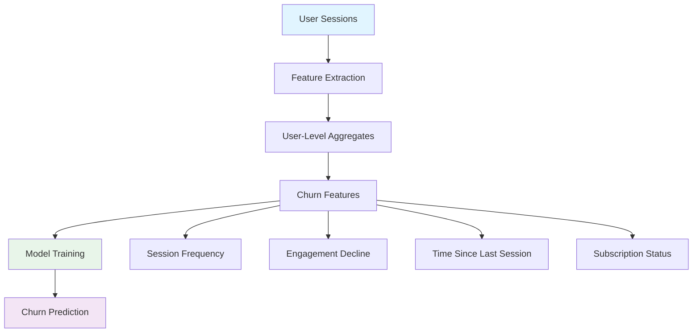

### 2. Content Recommendation

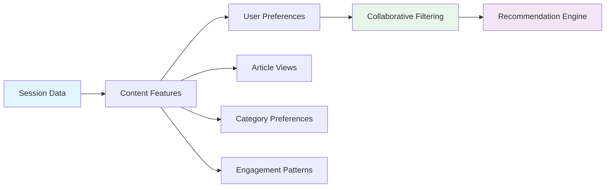

### 3. Subscription Conversion

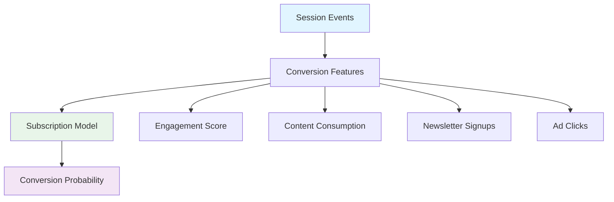

### 4. User Segmentation

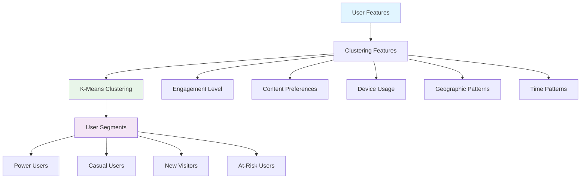

## Feature Store Structure

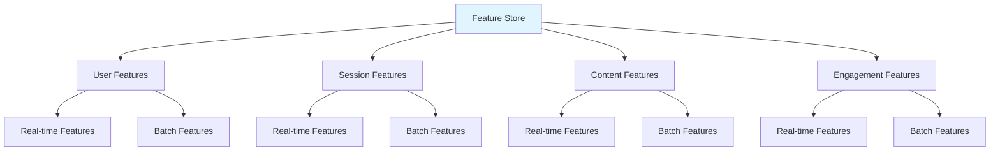

## Real-Time Feature Extraction

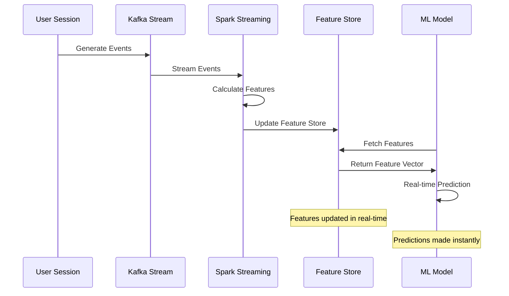

## Data Access Patterns for ML

### Pattern 1: Batch Training

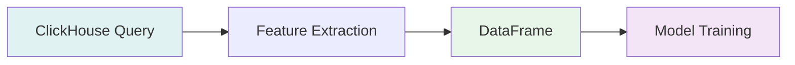

### Pattern 2: Real-Time Inference

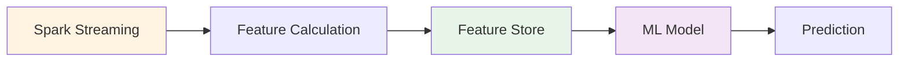

### Pattern 3: Historical Analysis

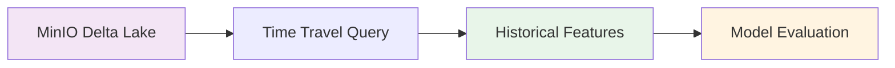

## Quick Start for ML Engineers

### 1. Get User Features

```python
from clickhouse_driver import Client

client = Client(host='localhost', port=9002, 
                database='analytics', user='default', 
                password='clickhouse')

# Get user features for ML
query = """
SELECT 
    user_id,
    count() as total_sessions,
    avg(session_duration_sec) as avg_duration,
    avg(total_events) as avg_events,
    avg(article_views) as avg_article_views,
    subscription_tier,
    country,
    device_type
FROM session_metrics
GROUP BY user_id, subscription_tier, country, device_type
"""

features = client.execute(query)
```

### 2. Get Session Features

```python
# Get session features for ML
query = """
SELECT 
    session_id,
    user_id,
    session_duration_sec,
    total_events,
    article_views,
    article_clicks,
    video_plays,
    pages_visited_count,
    unique_categories_count,
    brand,
    country,
    device_type,
    subscription_tier
FROM session_metrics
WHERE session_start >= now() - INTERVAL 30 DAY
"""

sessions = client.execute(query)
```

### 3. Get Engagement Features

```python
# Calculate engagement score
query = """
SELECT 
    session_id,
    user_id,
    (
        (article_views * 2) +
        (article_clicks * 3) +
        (video_plays * 5) +
        (newsletter_signups * 20)
    ) as engagement_score,
    session_duration_sec,
    total_events
FROM session_metrics
ORDER BY session_start DESC
LIMIT 10000
"""

engagement = client.execute(query)
```

## Model Training Data Pipeline

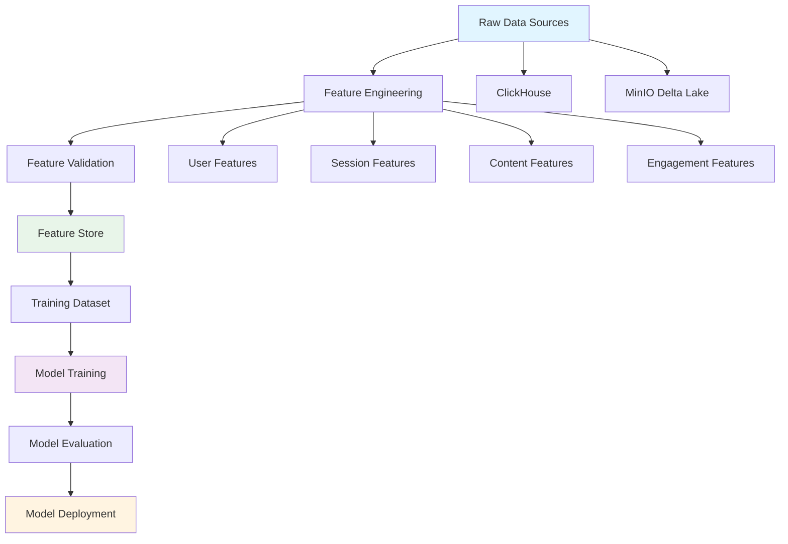

## Feature Importance

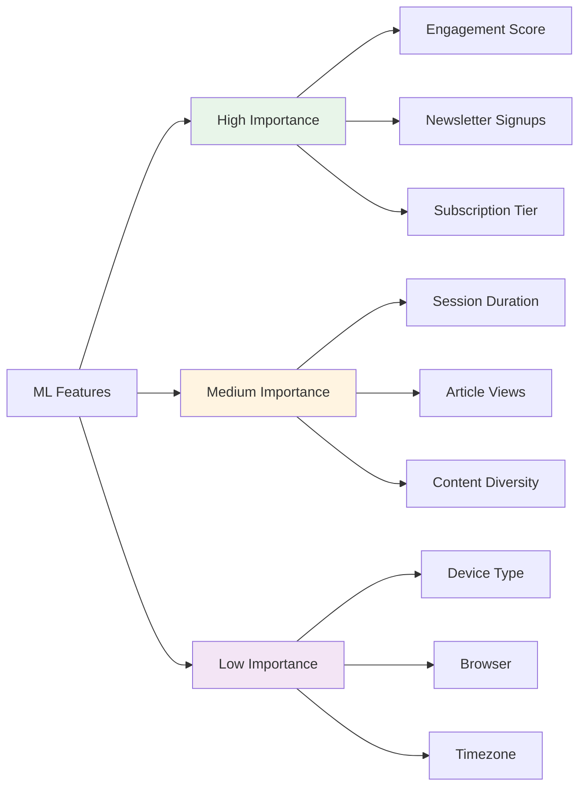

## Best Practices

### 1. Feature Engineering

- **Normalize features**: Use min-max or z-score normalization
- **Handle missing values**: Use median/mode for categorical, mean for numerical
- **Feature selection**: Remove highly correlated features
- **Time-based features**: Extract hour, day, week, month

### 2. Data Quality

- **Validate features**: Check for nulls, outliers, inconsistencies
- **Monitor data drift**: Track feature distributions over time
- **Feature versioning**: Track feature definitions and transformations

### 3. Performance

- **Pre-compute features**: Use materialized views in ClickHouse
- **Cache frequently used queries**: Store results in feature store
- **Incremental updates**: Update features incrementally, not from scratch

## Example ML Workflow

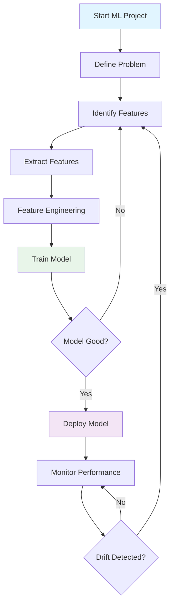

