# Deployment Guide

## Production Deployment Architecture

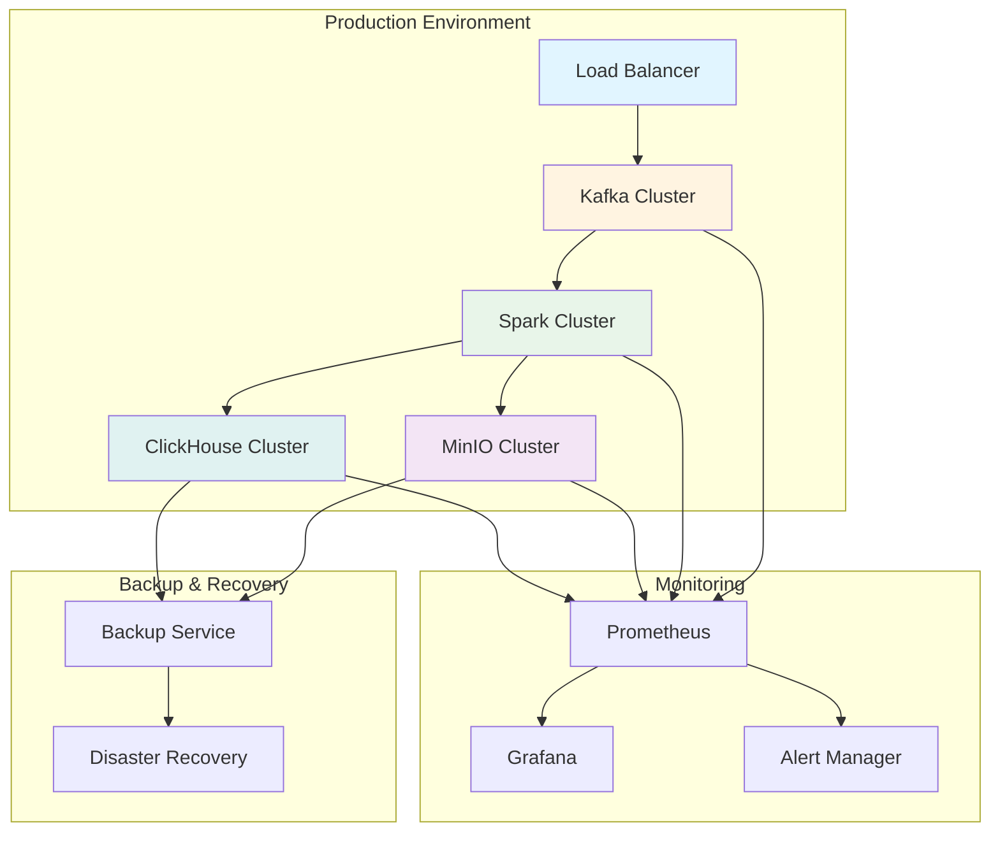

## Deployment Steps

### Step 1: Infrastructure Setup

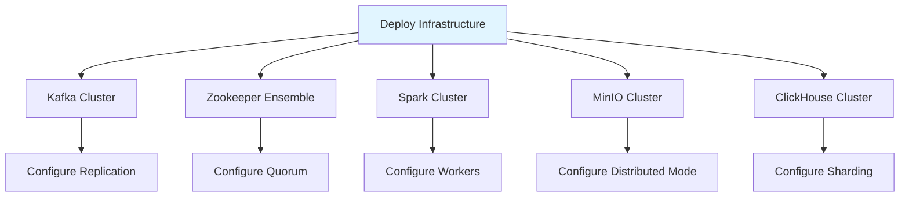

### Step 2: Configuration

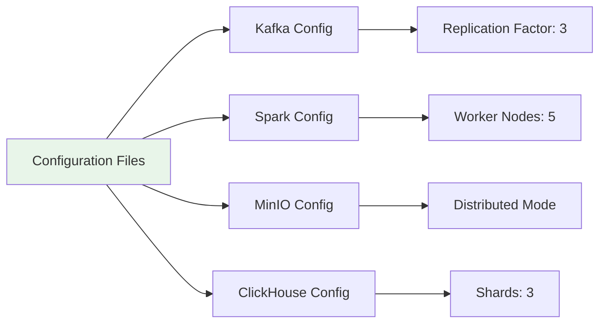

### Step 3: Schema Deployment

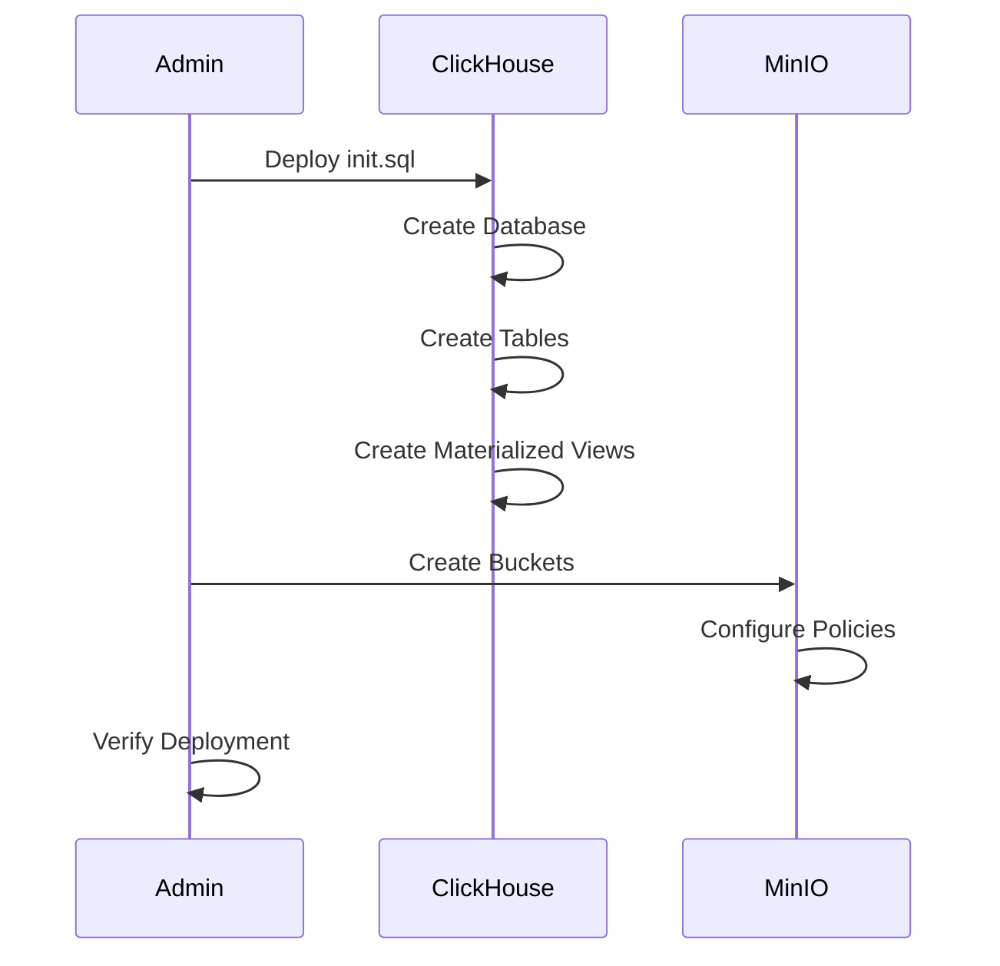

### Step 4: Application Deployment

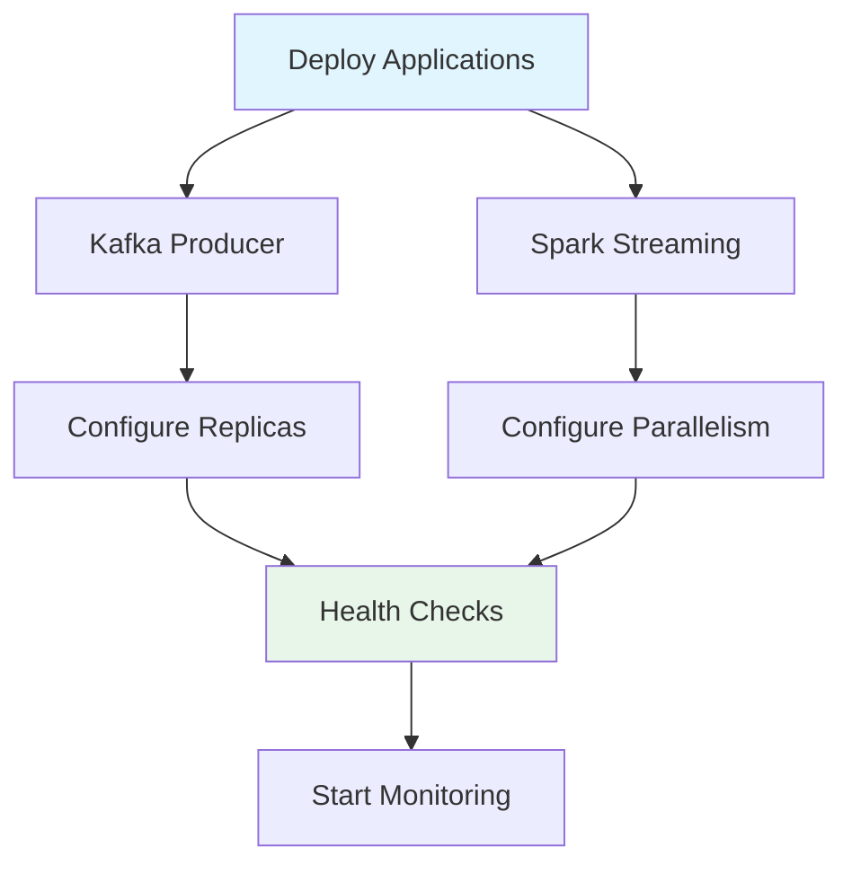

## Monitoring & Observability

### Metrics Collection

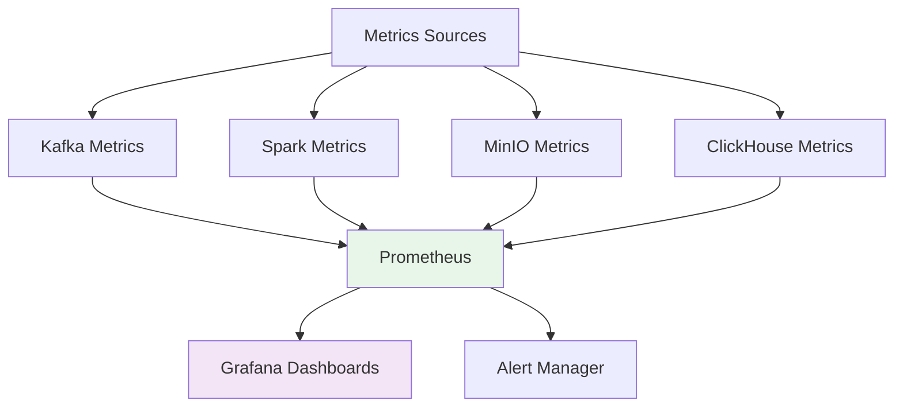

### Key Metrics

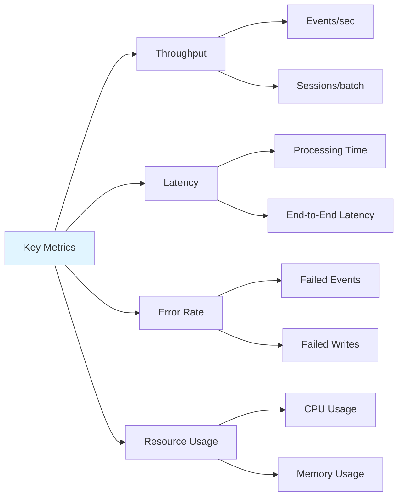

## Scaling Strategy

### Horizontal Scaling

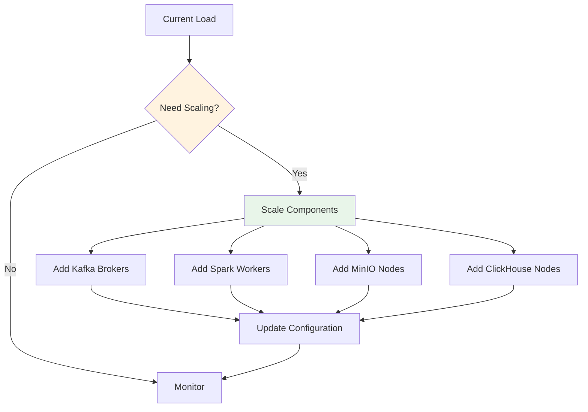

### Auto-Scaling Triggers

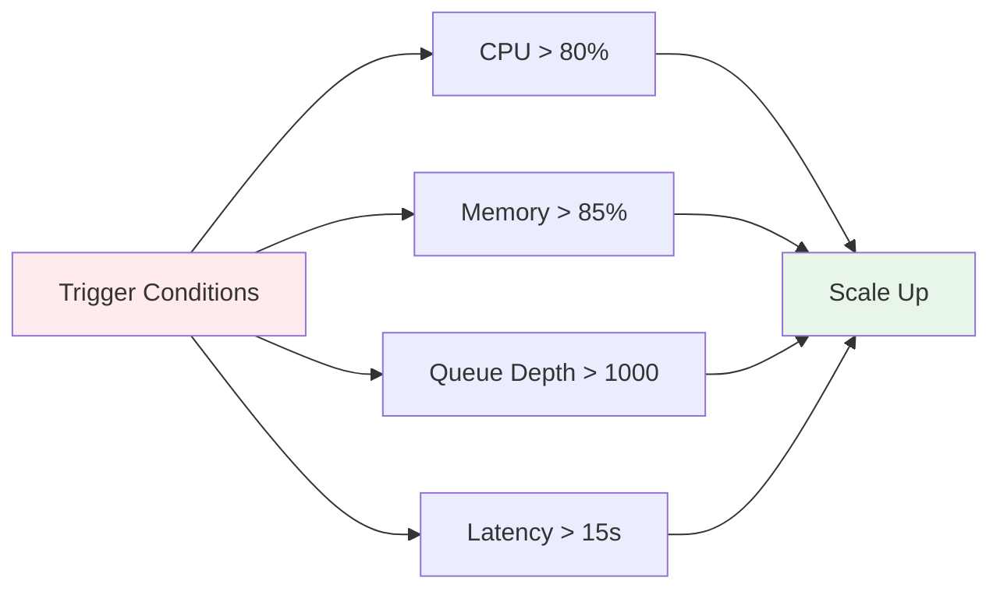

## Backup & Recovery

### Backup Strategy

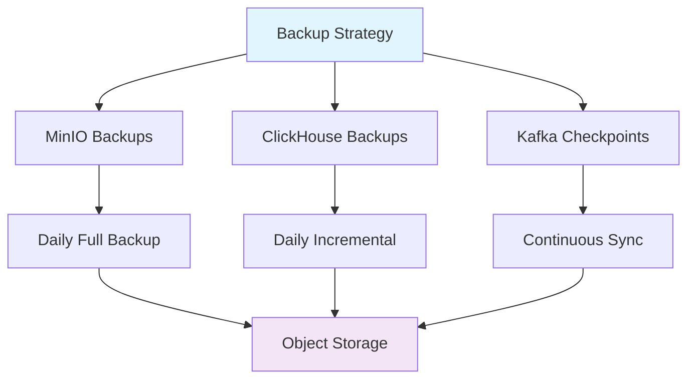

### Recovery Process

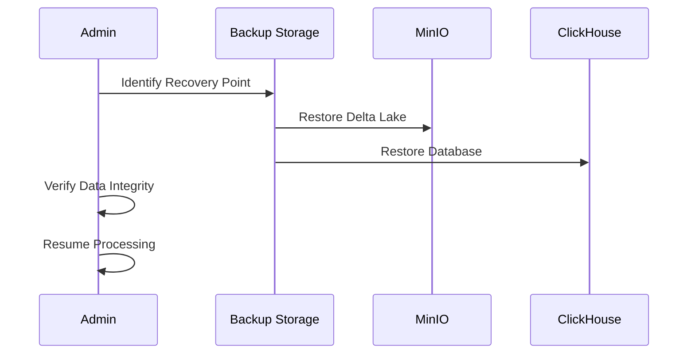

## Disaster Recovery

### DR Architecture

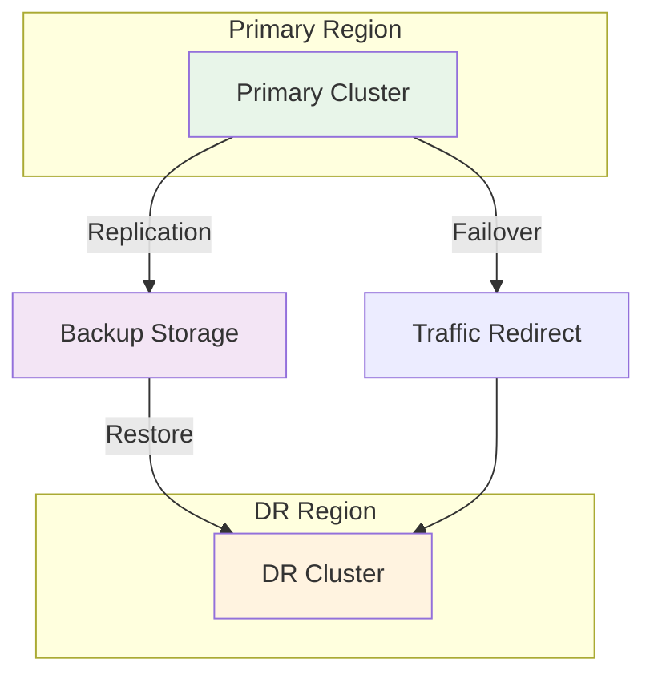

## Performance Tuning

### Optimization Areas

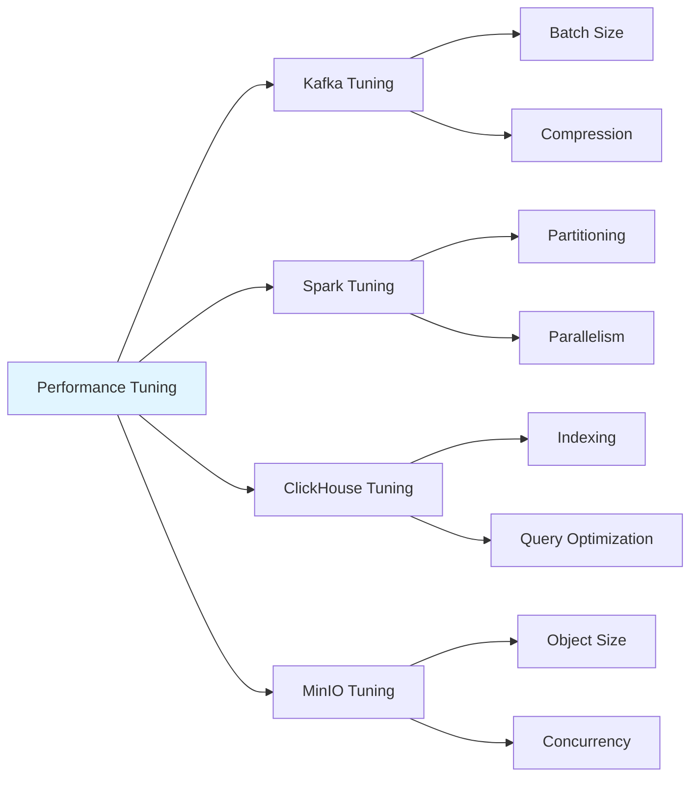

## Security Configuration

### Security Layers

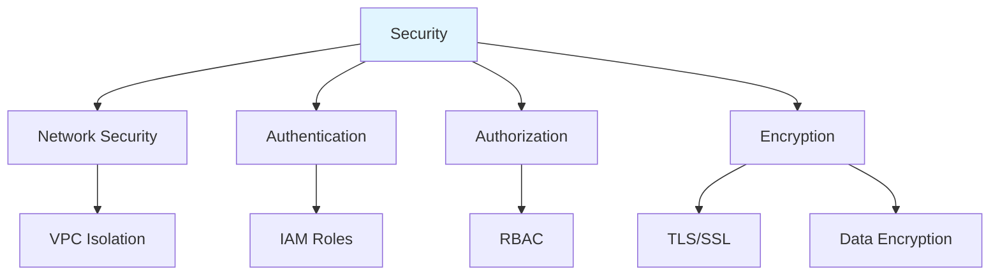

