# ML Models for Media Publishing Analytics

## Overview

This document provides ML model recommendations for various use cases in the Media Publishing real-time analytics pipeline.

## ML Use Cases and Model Recommendations

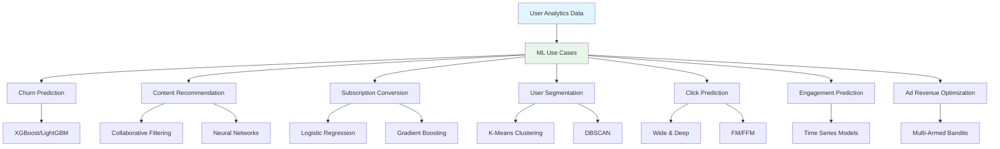

## 1. Churn Prediction

### Problem Statement
Predict which users are likely to churn (stop using the platform or unsubscribe) in the next 30 days.

### Recommended Model: XGBoost/LightGBM

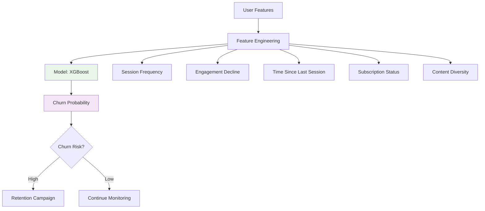

### Why XGBoost/LightGBM?
- **Handles non-linear relationships** well
- **Feature importance** for interpretability
- **Handles missing values** automatically
- **Fast training** on large datasets
- **Good performance** on tabular data

### Feature Set
```python
features = [
    'total_sessions',           # Behavioral
    'avg_session_duration',     # Engagement
    'days_since_last_session',  # Recency
    'engagement_score_trend',   # Trend
    'subscription_tier',         # Value
    'newsletter_status',         # Engagement
    'content_diversity',         # Interest
    'device_usage_pattern',     # Behavior
    'geographic_pattern',       # Context
    'session_frequency_decline'  # Churn signal
]
```

### Model Architecture
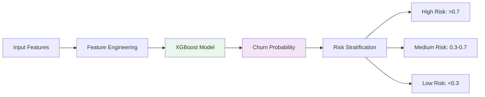

### Implementation
```python
import xgboost as xgb
from sklearn.model_selection import train_test_split

# Prepare features
X = user_features_df[feature_columns]
y = user_features_df['churned_in_30_days']

# Train model
model = xgb.XGBClassifier(
    objective='binary:logistic',
    n_estimators=1000,
    max_depth=6,
    learning_rate=0.01,
    subsample=0.8,
    colsample_bytree=0.8,
    eval_metric='auc',
    early_stopping_rounds=50
)

X_train, X_test, y_train, y_test = train_test_split(X, y, test_size=0.2)
model.fit(X_train, y_train, eval_set=[(X_test, y_test)])
```

## 2. Content Recommendation

### Problem Statement
Recommend articles to users based on their reading history and preferences.

### Recommended Model: Hybrid Recommendation System

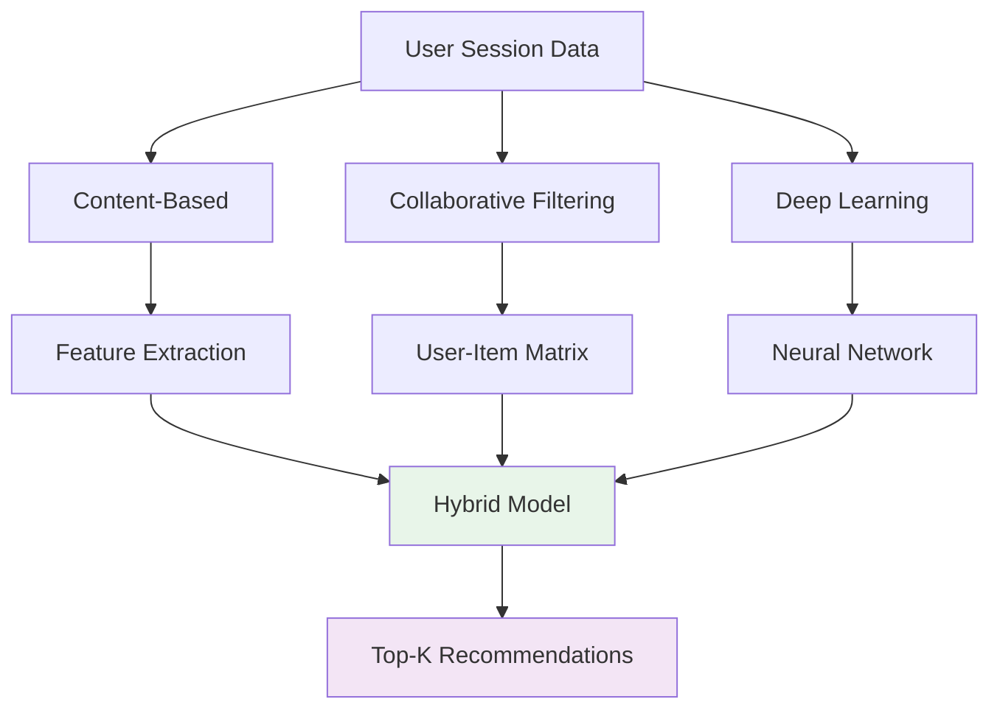

### Why Hybrid Approach?
- **Content-Based**: Handles cold start (new users/articles)
- **Collaborative Filtering**: Leverages user behavior patterns
- **Deep Learning**: Captures complex interactions

### Model Architecture

#### A. Collaborative Filtering (Matrix Factorization)
```python
from implicit.als import AlternatingLeastSquares

# User-item interaction matrix
model = AlternatingLeastSquares(
    factors=50,
    regularization=0.1,
    iterations=50
)

model.fit(user_item_matrix)
recommendations = model.recommend(user_id, user_item_matrix, N=10)
```

#### B. Deep Learning (Neural Collaborative Filtering)
```python
import tensorflow as tf
from tensorflow import keras

# Wide & Deep model
def build_wide_deep_model():
    # Wide component (linear)
    wide = keras.layers.Dense(1, activation='sigmoid')
    
    # Deep component (non-linear)
    deep = keras.Sequential([
        keras.layers.Dense(128, activation='relu'),
        keras.layers.Dropout(0.3),
        keras.layers.Dense(64, activation='relu'),
        keras.layers.Dropout(0.3),
        keras.layers.Dense(32, activation='relu'),
        keras.layers.Dense(1, activation='sigmoid')
    ])
    
    # Combine
    combined = keras.layers.Concatenate()([wide, deep])
    output = keras.layers.Dense(1, activation='sigmoid')(combined)
    
    return keras.Model(inputs=[wide_input, deep_input], outputs=output)
```

## 3. Subscription Conversion

### Problem Statement
Predict probability of free users converting to paid subscription.

### Recommended Model: Gradient Boosting (LightGBM)

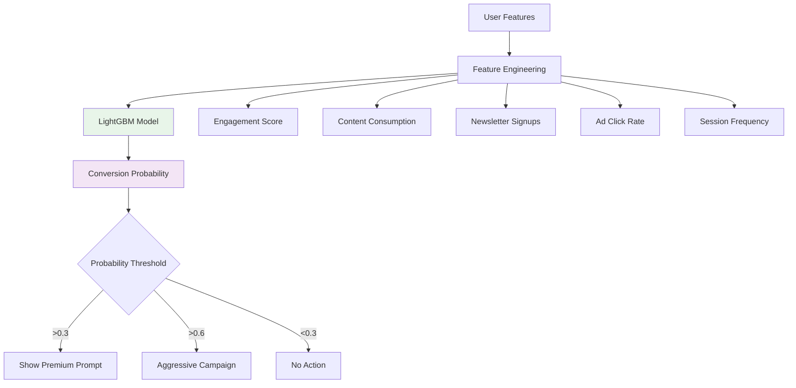

### Why LightGBM?
- **Fast training** on large datasets
- **Handles categorical features** natively
- **Good for imbalanced data** (conversion rate typically low)
- **Feature importance** for business insights

### Feature Importance
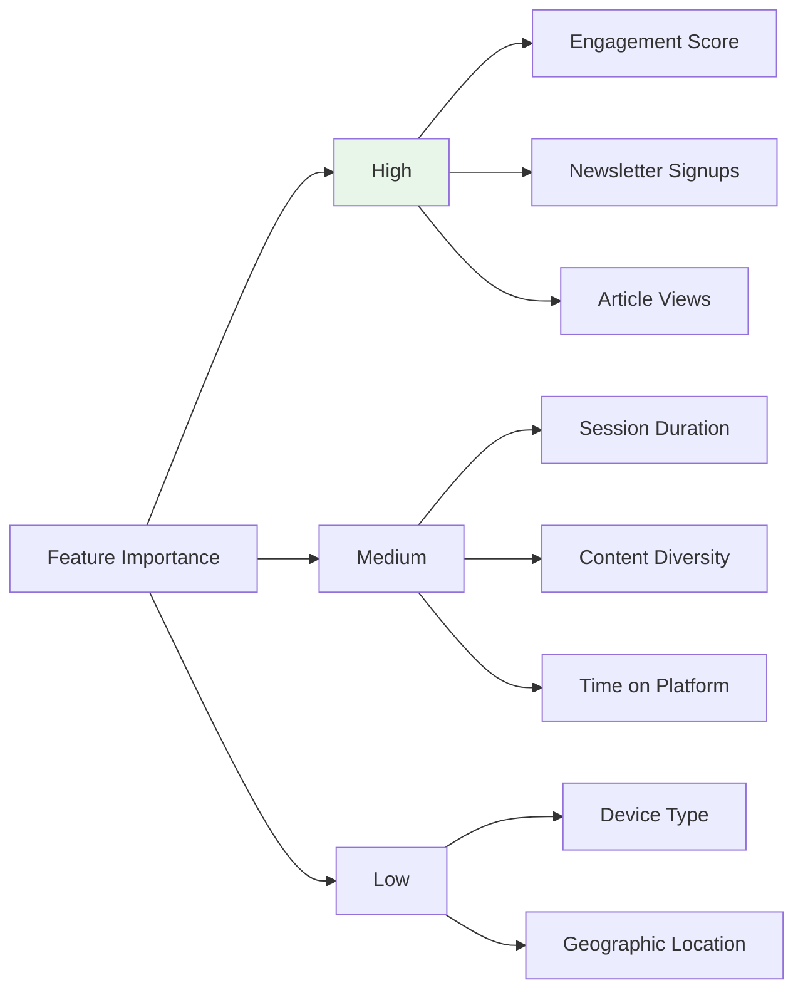

### Implementation
```python
import lightgbm as lgb

# Prepare data
train_data = lgb.Dataset(
    X_train, 
    label=y_train,
    categorical_feature=['brand', 'country', 'device_type', 'subscription_tier']
)

# Model parameters
params = {
    'objective': 'binary',
    'metric': 'auc',
    'boosting_type': 'gbdt',
    'num_leaves': 31,
    'learning_rate': 0.05,
    'feature_fraction': 0.9,
    'bagging_fraction': 0.8,
    'bagging_freq': 5,
    'verbose': 0
}

# Train
model = lgb.train(params, train_data, num_boost_round=1000)
```

## 4. User Segmentation

### Problem Statement
Cluster users into distinct segments for personalized marketing and content delivery.

### Recommended Model: K-Means Clustering with PCA

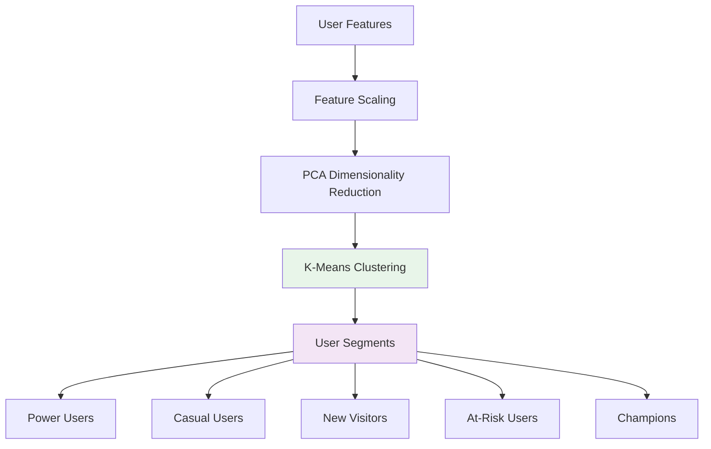

### Why K-Means with PCA?
- **Interpretable segments** (clear clusters)
- **Handles high-dimensional data** with PCA
- **Fast clustering** on large datasets
- **Easy to visualize** and explain

### Feature Set for Clustering
```python
clustering_features = [
    'avg_session_duration',
    'avg_events_per_session',
    'session_frequency',
    'engagement_score',
    'content_diversity',
    'subscription_tier_encoded',
    'device_usage_pattern',
    'time_pattern_encoded'
]
```

### Implementation
```python
from sklearn.cluster import KMeans
from sklearn.decomposition import PCA
from sklearn.preprocessing import StandardScaler

# Scale features
scaler = StandardScaler()
X_scaled = scaler.fit_transform(user_features[clustering_features])

# PCA for dimensionality reduction
pca = PCA(n_components=0.95)  # Keep 95% variance
X_pca = pca.fit_transform(X_scaled)

# K-Means clustering
kmeans = KMeans(n_clusters=5, random_state=42, n_init=10)
segments = kmeans.fit_predict(X_pca)

# Analyze segments
user_features['segment'] = segments
segment_analysis = user_features.groupby('segment').agg({
    'avg_session_duration': 'mean',
    'engagement_score': 'mean',
    'subscription_tier': lambda x: x.mode()[0]
})
```

## 5. Click Prediction (Article/Ad)

### Problem Statement
Predict probability of user clicking on an article or ad.

### Recommended Model: Wide & Deep Neural Network

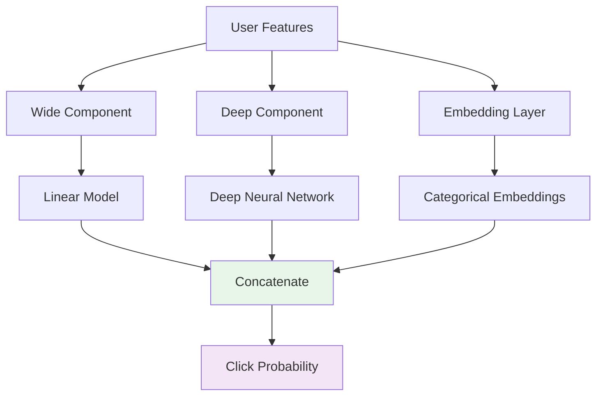

### Why Wide & Deep?
- **Wide component**: Memorizes feature interactions
- **Deep component**: Generalizes to unseen combinations
- **Handles sparse features** (categorical) well
- **State-of-the-art** for click prediction

### Model Architecture
```python
import tensorflow as tf
from tensorflow import keras

def build_wide_deep_model():
    # Inputs
    user_features = keras.Input(shape=(num_user_features,), name='user_features')
    article_features = keras.Input(shape=(num_article_features,), name='article_features')
    categorical_features = keras.Input(shape=(num_categorical,), name='categorical')
    
    # Wide component (linear)
    wide = keras.layers.Concatenate()([user_features, article_features])
    wide_output = keras.layers.Dense(1, activation='sigmoid', name='wide_output')(wide)
    
    # Deep component
    deep = keras.layers.Concatenate()([user_features, article_features])
    deep = keras.layers.Dense(128, activation='relu')(deep)
    deep = keras.layers.Dropout(0.3)(deep)
    deep = keras.layers.Dense(64, activation='relu')(deep)
    deep = keras.layers.Dropout(0.3)(deep)
    deep = keras.layers.Dense(32, activation='relu')(deep)
    deep_output = keras.layers.Dense(1, activation='sigmoid', name='deep_output')(deep)
    
    # Embeddings for categorical features
    embeddings = keras.layers.Embedding(vocab_size, embedding_dim)(categorical_features)
    embeddings = keras.layers.Flatten()(embeddings)
    
    # Combine
    combined = keras.layers.Concatenate()([wide_output, deep_output, embeddings])
    output = keras.layers.Dense(1, activation='sigmoid', name='prediction')(combined)
    
    model = keras.Model(
        inputs=[user_features, article_features, categorical_features],
        outputs=output
    )
    
    model.compile(
        optimizer='adam',
        loss='binary_crossentropy',
        metrics=['accuracy', 'auc']
    )
    
    return model
```

## 6. Engagement Prediction

### Problem Statement
Predict user engagement level for the next session.

### Recommended Model: Time Series + Regression

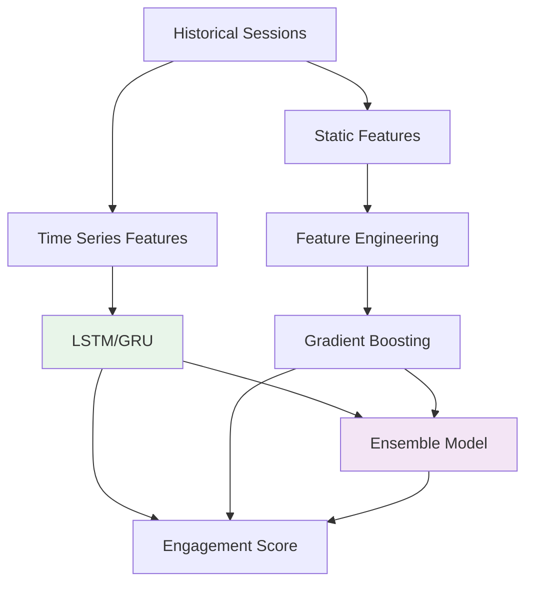

### Why LSTM/GRU + Gradient Boosting?
- **LSTM/GRU**: Captures temporal patterns in session sequences
- **Gradient Boosting**: Handles static features and non-linear relationships
- **Ensemble**: Best of both worlds

### Implementation
```python
import tensorflow as tf
from tensorflow import keras
import lightgbm as lgb

# LSTM for temporal patterns
def build_lstm_model():
    model = keras.Sequential([
        keras.layers.LSTM(64, return_sequences=True, input_shape=(sequence_length, num_features)),
        keras.layers.Dropout(0.3),
        keras.layers.LSTM(32, return_sequences=False),
        keras.layers.Dropout(0.3),
        keras.layers.Dense(16, activation='relu'),
        keras.layers.Dense(1, activation='linear')  # Regression
    ])
    
    model.compile(optimizer='adam', loss='mse', metrics=['mae'])
    return model

# Gradient Boosting for static features
lgb_model = lgb.LGBMRegressor(
    n_estimators=1000,
    learning_rate=0.01,
    num_leaves=31,
    objective='regression',
    metric='rmse'
)

# Ensemble
def predict_engagement(sequence_features, static_features):
    lstm_pred = lstm_model.predict(sequence_features)
    lgb_pred = lgb_model.predict(static_features)
    
    # Weighted ensemble
    final_pred = 0.6 * lstm_pred + 0.4 * lgb_pred
    return final_pred
```

## 7. Ad Revenue Optimization

### Problem Statement
Optimize ad placement and bidding to maximize revenue.

### Recommended Model: Multi-Armed Bandit (Thompson Sampling)

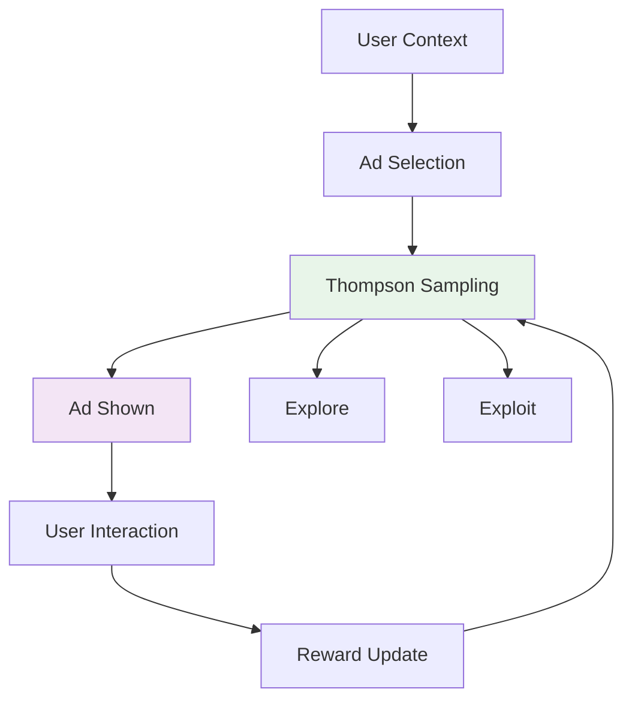

### Why Thompson Sampling?
- **Balances exploration/exploitation** automatically
- **Adapts to changing user preferences** in real-time
- **Maximizes long-term revenue**
- **No offline training** required

### Implementation
```python
import numpy as np
from scipy import stats

class ThompsonSampling:
    def __init__(self, n_ads):
        self.n_ads = n_ads
        self.alpha = np.ones(n_ads)  # Success count
        self.beta = np.ones(n_ads)    # Failure count
    
    def select_ad(self):
        # Sample from Beta distribution for each ad
        samples = [
            np.random.beta(self.alpha[i], self.beta[i])
            for i in range(self.n_ads)
        ]
        return np.argmax(samples)
    
    def update(self, ad, reward):
        if reward > 0:  # Click or conversion
            self.alpha[ad] += 1
        else:
            self.beta[ad] += 1
```

## Model Comparison Matrix

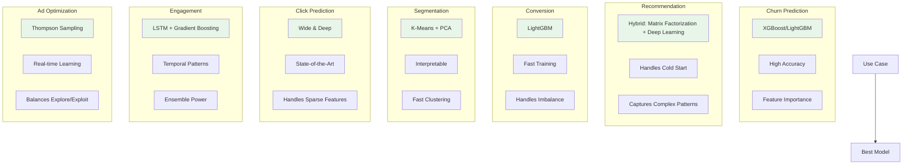

## Real-Time ML Pipeline

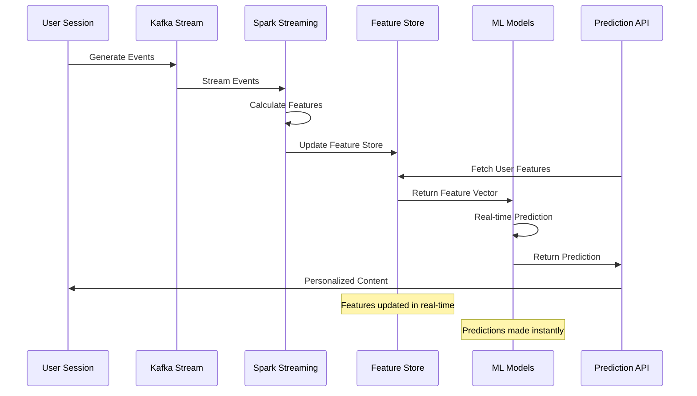

## Model Deployment Strategy

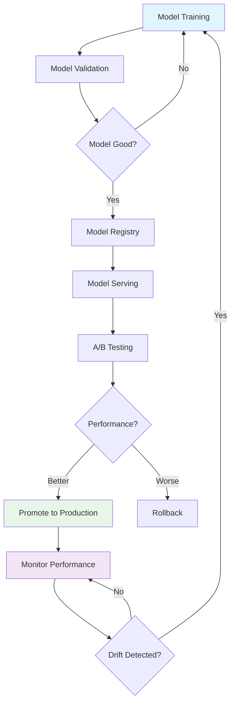

## Recommended Tech Stack

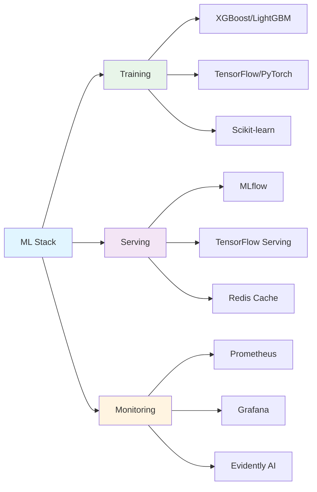

## Quick Recommendations Summary

| Use Case | Best Model | Reason |
|----------|-----------|--------|
| **Churn Prediction** | XGBoost/LightGBM | High accuracy, interpretable, handles tabular data well |
| **Content Recommendation** | Hybrid (Matrix Factorization + Deep Learning) | Handles cold start, captures complex patterns |
| **Subscription Conversion** | LightGBM | Fast, handles imbalanced data, categorical features |
| **User Segmentation** | K-Means + PCA | Interpretable, fast, easy to visualize |
| **Click Prediction** | Wide & Deep Neural Network | State-of-the-art, handles sparse features |
| **Engagement Prediction** | LSTM + Gradient Boosting Ensemble | Captures temporal patterns + static features |
| **Ad Optimization** | Thompson Sampling | Real-time learning, balances exploration/exploitation |

## Next Steps

1. **Start with Churn Prediction** (XGBoost) - Highest business impact
2. **Implement Content Recommendation** (Hybrid) - Improves user experience
3. **Add Conversion Prediction** (LightGBM) - Direct revenue impact
4. **Deploy User Segmentation** (K-Means) - Marketing personalization
5. **Optimize with Click Prediction** (Wide & Deep) - Content optimization

