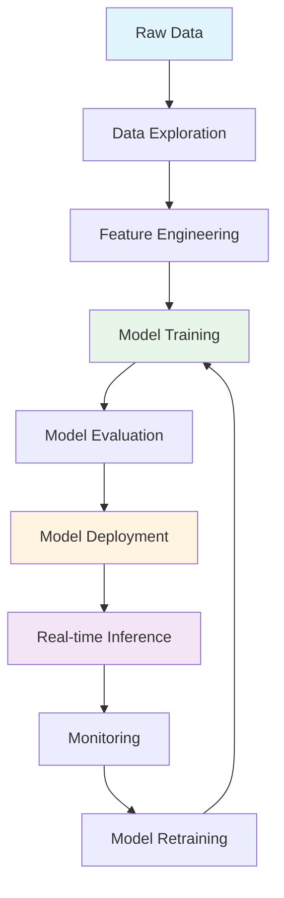
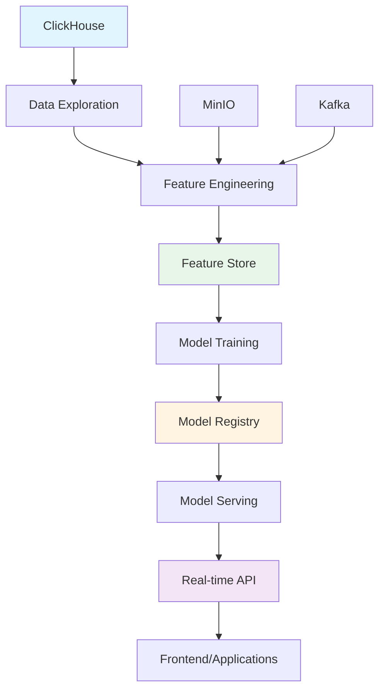
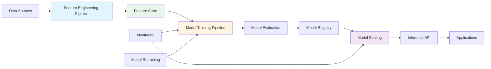
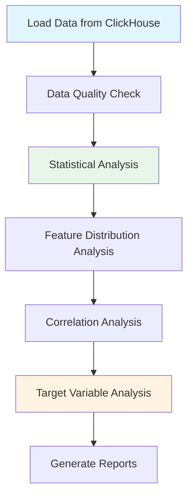
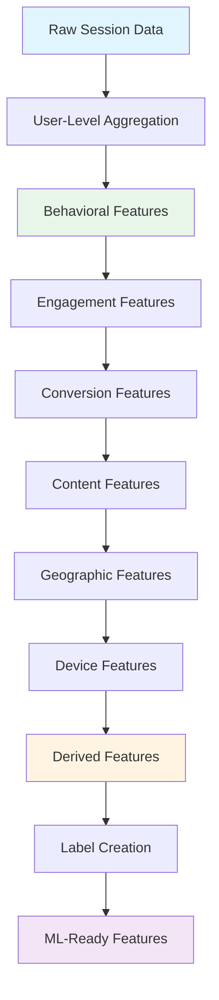
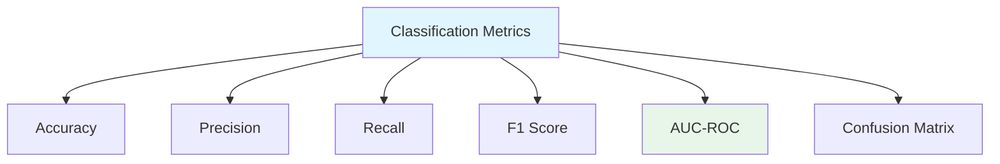
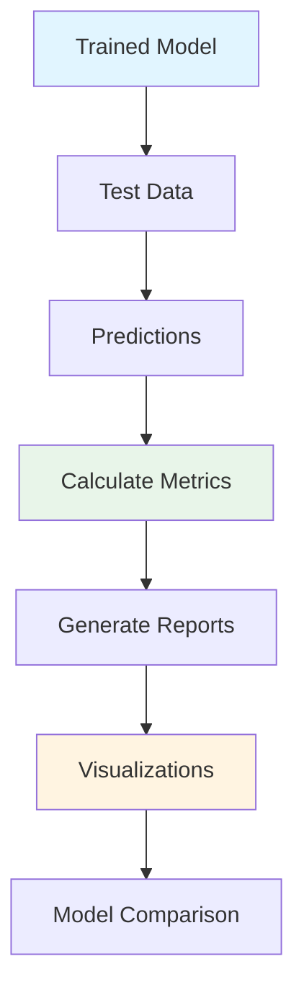
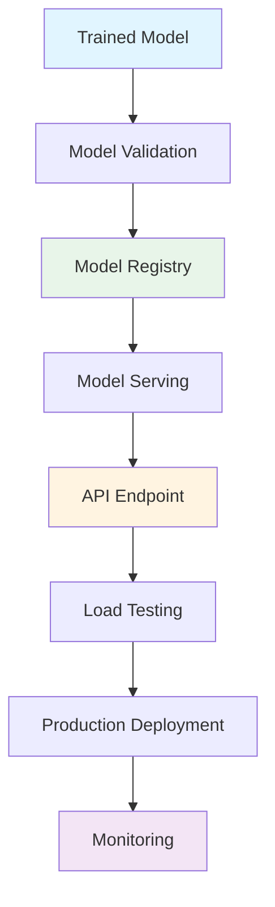

# ML Pipeline Documentation

Complete documentation for the Media Publishing Machine Learning Pipeline.

## 📋 Table of Contents

1. [Overview](#overview)
2. [ML Pipeline Architecture](#ml-pipeline-architecture)
3. [Data Exploration](#data-exploration)
4. [Feature Engineering](#feature-engineering)
5. [Model Implementations](#model-implementations)
6. [Model Evaluation](#model-evaluation)
7. [Model Deployment](#model-deployment)
8. [Best Practices](#best-practices)
9. [Troubleshooting](#troubleshooting)

## Overview

The ML pipeline processes real-time user behavior data to generate actionable insights and predictions for Media Publishing's digital publishing platforms.

### Pipeline Flow



### Key Capabilities

- **Churn Prediction**: Identify users at risk of churning
- **User Segmentation**: Group users into behavioral segments
- **Content Recommendation**: Personalize content recommendations
- **Conversion Prediction**: Predict subscription conversions
- **Click Prediction**: Optimize article click-through rates
- **Engagement Prediction**: Predict user engagement levels
- **Ad Optimization**: Maximize ad revenue through intelligent placement

## ML Pipeline Architecture

### High-Level Architecture



### Component Architecture



## Data Exploration

### Purpose

Data exploration helps understand data quality, distributions, and patterns before feature engineering and model training.

### Process



### Usage

```bash
# Run data exploration
cd backend/kafka_check/ml
python 01_data_exploration.py
```

### Outputs

- **Data Summary**: Total sessions, date range, unique users
- **Numerical Statistics**: Mean, median, std dev for all features
- **User-Level Features**: Aggregated user features for ML
- **Feature Correlations**: Correlation matrix visualization
- **Target Variables**: Churn rate, conversion rate, engagement distribution

### Key Metrics

- **Data Quality**: Missing values, data types, distributions
- **Feature Availability**: Available features for model training
- **Target Distribution**: Class imbalance, target variable distribution
- **Feature Correlations**: Multicollinearity detection

## Feature Engineering

### Purpose

Feature engineering transforms raw data into ML-ready features that capture user behavior patterns and characteristics.

### Process



### Feature Categories

#### 1. Behavioral Features
- Total sessions
- Average session duration
- Session frequency
- Event counts per session

#### 2. Engagement Features
- Article views
- Article clicks
- Video plays
- Newsletter signups
- Engagement score

#### 3. Conversion Features
- Newsletter signup rate
- Conversion indicators
- High-value conversion flags

#### 4. Content Features
- Brand preferences
- Category diversity
- Content consumption patterns

#### 5. Geographic Features
- Primary country
- Primary city
- Timezone

#### 6. Device Features
- Device type
- Operating system
- Browser

#### 7. Derived Features
- Click-through rate
- Engagement per minute
- Recency score
- Activity score
- Brand loyalty score

### Usage

```bash
# Run feature engineering
cd backend/kafka_check/ml
python 02_feature_engineering.py
```

### Outputs

- **ML-Ready Features**: `user_features_ml_ready.csv`
- **Feature List**: `feature_list.json`
- **Labels**: Churn, conversion, high-value conversion

## Model Implementations

### 1. Baseline Models

**File**: `03_baseline_models.py`

**Purpose**: Establish baseline performance for comparison with advanced models.

**Algorithms**:
- Logistic Regression
- Random Forest
- Neural Network (MLP)

**Usage**:
```bash
python 03_baseline_models.py
```

**Outputs**:
- Model comparison metrics
- Baseline model files
- Comparison visualizations

### 2. Churn Prediction

**File**: `04_churn_prediction.py`

**Purpose**: Predict users at risk of churning (inactive for 30+ days).

**Algorithm**: XGBoost (Gradient Boosting)

**Features**:
- Session frequency
- Engagement metrics
- Recency scores
- Activity patterns

**Usage**:
```bash
python 04_churn_prediction.py
```

**Outputs**:
- Trained model: `models/churn_model_xgboost.pkl`
- Metrics: Accuracy, Precision, Recall, F1, AUC-ROC
- Feature importance visualization
- ROC curve

**Model Performance Targets**:
- AUC-ROC > 0.85
- Precision > 0.80
- Recall > 0.75

### 3. User Segmentation

**File**: `05_user_segmentation.py`

**Purpose**: Group users into behavioral segments for personalized marketing.

**Algorithm**: K-Means Clustering with PCA

**Process**:
1. Feature scaling and PCA
2. Optimal cluster number selection
3. K-Means clustering
4. Segment profile analysis

**Usage**:
```bash
python 05_user_segmentation.py
```

**Outputs**:
- User segments: `user_segments.csv`
- Segment profiles: `segment_profiles.csv`
- Segmentation model
- Visualization plots

**Segment Types**:
- High-engagement users
- Casual browsers
- Newsletter subscribers
- Video consumers
- Mobile-first users

### 4. Content Recommendation

**File**: `06_recommendation_system.py`

**Purpose**: Recommend personalized content to users.

**Algorithm**: Hybrid (Collaborative Filtering + Content-Based)

**Components**:
- **Collaborative Filtering**: Non-Negative Matrix Factorization (NMF)
- **Content-Based Filtering**: Cosine similarity on content features
- **Hybrid**: Weighted combination of both approaches

**Usage**:
```bash
python 06_recommendation_system.py
```

**Outputs**:
- Recommendation model
- User-item interaction matrix
- Content features
- Evaluation metrics (Precision, Recall)

**Recommendation Strategy**:
- Collaborative filtering captures user preferences
- Content-based filtering handles cold-start
- Hybrid approach balances both

### 5. Conversion Prediction

**File**: `07_conversion_prediction.py`

**Purpose**: Predict likelihood of newsletter subscription conversion.

**Algorithm**: LightGBM (Gradient Boosting)

**Features**:
- Engagement patterns
- Content preferences
- Behavioral signals
- Session characteristics

**Usage**:
```bash
python 07_conversion_prediction.py
```

**Outputs**:
- Trained model: `models/conversion_model_lightgbm.pkl`
- Metrics: Accuracy, Precision, Recall, F1, AUC-ROC
- Feature importance
- ROC curve

**Model Performance Targets**:
- AUC-ROC > 0.80
- Precision > 0.75
- Recall > 0.70

### 6. Click Prediction

**File**: `08_click_prediction.py`

**Purpose**: Predict article click-through rates for optimization.

**Algorithm**: XGBoost

**Features**:
- User click history
- Article popularity
- Time-based features
- Device and location features

**Usage**:
```bash
python 08_click_prediction.py
```

**Outputs**:
- Trained model: `models/click_prediction_model.pkl`
- Metrics: Accuracy, Precision, Recall, F1, AUC-ROC
- Feature importance

**Use Cases**:
- Article ranking optimization
- Personalized content placement
- A/B testing support

### 7. Engagement Prediction

**File**: `09_engagement_prediction.py`

**Purpose**: Predict user engagement scores for content optimization.

**Algorithm**: XGBoost (Regression)

**Features**:
- Session characteristics
- User history
- Content features
- Time-based features

**Usage**:
```bash
python 09_engagement_prediction.py
```

**Outputs**:
- Trained model: `models/engagement_prediction_model.pkl`
- Metrics: RMSE, MAE, R² Score
- Prediction vs Actual scatter plot
- Residual plot

**Model Performance Targets**:
- R² Score > 0.70
- RMSE < 10.0
- MAE < 5.0

### 8. Ad Revenue Optimization

**File**: `10_ad_optimization.py`

**Purpose**: Optimize ad placement for maximum revenue.

**Algorithm**: Thompson Sampling (Multi-Armed Bandit)

**Process**:
1. Revenue prediction model
2. Ad placement simulation
3. Thompson Sampling optimization
4. Best placement selection

**Usage**:
```bash
python 10_ad_optimization.py
```

**Outputs**:
- Thompson Sampling model
- Revenue prediction model
- Ad placement statistics
- Optimization visualizations

**Optimization Strategy**:
- Explore different ad placements
- Exploit high-performing placements
- Balance exploration vs exploitation

## Model Evaluation

### Evaluation Metrics

#### Classification Metrics



- **Accuracy**: Overall correctness
- **Precision**: True positives / (True positives + False positives)
- **Recall**: True positives / (True positives + False negatives)
- **F1 Score**: Harmonic mean of precision and recall
- **AUC-ROC**: Area under ROC curve (for binary classification)

#### Regression Metrics

- **RMSE**: Root Mean Squared Error
- **MAE**: Mean Absolute Error
- **R² Score**: Coefficient of determination

#### Clustering Metrics

- **Silhouette Score**: Measure of cluster separation
- **Davies-Bouldin Score**: Cluster quality measure (lower is better)

### Evaluation Process



### Model Comparison

Compare models using:
- Cross-validation scores
- Test set performance
- Feature importance
- Training time
- Inference latency

## Model Deployment

### Deployment Pipeline



### Model Registry

Store models with:
- Model version
- Training metrics
- Feature list
- Training timestamp
- Model metadata

### Model Serving

**Options**:
1. **REST API**: Flask/FastAPI endpoint
2. **Batch Inference**: Scheduled predictions
3. **Real-time Inference**: Stream processing

### Monitoring

Monitor:
- Prediction latency
- Model accuracy drift
- Feature distribution shifts
- Error rates

## Best Practices

### 1. Data Quality

- ✅ Validate data before feature engineering
- ✅ Handle missing values appropriately
- ✅ Check for data drift
- ✅ Monitor data quality metrics

### 2. Feature Engineering

- ✅ Create interpretable features
- ✅ Avoid data leakage
- ✅ Scale features appropriately
- ✅ Handle categorical variables

### 3. Model Training

- ✅ Use cross-validation
- ✅ Split data properly (train/validation/test)
- ✅ Handle class imbalance
- ✅ Tune hyperparameters

### 4. Model Evaluation

- ✅ Evaluate on held-out test set
- ✅ Use appropriate metrics
- ✅ Analyze feature importance
- ✅ Check for overfitting

### 5. Model Deployment

- ✅ Version control models
- ✅ Document model assumptions
- ✅ Monitor model performance
- ✅ Plan for model retraining

### 6. Model Maintenance

- ✅ Retrain models regularly
- ✅ Monitor data drift
- ✅ Update features as needed
- ✅ A/B test new models

## Troubleshooting

### Common Issues

#### 1. Low Model Performance

**Symptoms**:
- Low accuracy/AUC-ROC
- Poor generalization

**Solutions**:
- Check feature quality
- Add more features
- Tune hyperparameters
- Handle class imbalance
- Get more training data

#### 2. Overfitting

**Symptoms**:
- High training accuracy, low test accuracy
- Large gap between train and test metrics

**Solutions**:
- Reduce model complexity
- Add regularization
- Use cross-validation
- Get more training data
- Feature selection

#### 3. Data Quality Issues

**Symptoms**:
- Missing values
- Inconsistent data types
- Outliers

**Solutions**:
- Impute missing values
- Validate data types
- Handle outliers
- Check data pipeline

#### 4. Slow Training

**Symptoms**:
- Long training times
- High memory usage

**Solutions**:
- Reduce data size (sampling)
- Feature selection
- Use faster algorithms
- Optimize hyperparameters
- Use distributed training

#### 5. Model Deployment Issues

**Symptoms**:
- High latency
- Memory errors
- Version conflicts

**Solutions**:
- Optimize model size
- Use model compression
- Cache predictions
- Version dependencies
- Load testing

## Quick Reference

### Model Training Commands

#### Option 1: Run All Models Automatically (Recommended)

```bash
# From kafka_check directory
cd backend/kafka_check

# Run complete ML pipeline
python run_ml.py
```

#### Option 2: Run Models Individually

```bash
# From ml directory
cd backend/kafka_check/ml

# 1. Data exploration
python 01_data_exploration.py

# 2. Feature engineering
python 02_feature_engineering.py

# 3. Baseline models
python 03_baseline_models.py

# 4. Churn prediction
python 04_churn_prediction.py

# 5. User segmentation
python 05_user_segmentation.py

# 6. Content recommendation
python 06_recommendation_system.py

# 7. Conversion prediction
python 07_conversion_prediction.py

# 8. Click prediction
python 08_click_prediction.py

# 9. Engagement prediction
python 09_engagement_prediction.py

# 10. Ad optimization
python 10_ad_optimization.py
```

#### Master Script Options

```bash
# Run complete pipeline
python run_ml.py

# Skip data exploration (if already done)
python run_ml.py --skip-exploration

# Skip feature engineering (if already done)
python run_ml.py --skip-features

# Run only models (skip exploration and features)
python run_ml.py --models-only

# Skip prerequisite checks
python run_ml.py --skip-prerequisites
```

### File Locations

```
ml/
├── models/              # Trained models
├── utils/               # Utility functions
├── *.py                 # Model scripts
├── *.csv                # Data files
├── *.png                # Visualizations
└── *.json               # Configurations
```

### Model Performance Targets

| Model | Metric | Target |
|-------|--------|--------|
| Churn Prediction | AUC-ROC | > 0.85 |
| Conversion Prediction | AUC-ROC | > 0.80 |
| Click Prediction | Precision | > 0.75 |
| Engagement Prediction | R² Score | > 0.70 |

## Resources

- [ML Roadmap](../ml/README.md) - Complete ML roadmap
- [ML Models Guide](./ml-models.md) - Model recommendations
- [Data Model Guide](./data-model.md) - Feature extraction guide
- [Architecture Guide](./architecture.md) - System architecture
- [API Reference](./api-reference.md) - API documentation

## Next Steps

1. **Run Data Exploration**: Understand your data
2. **Create Features**: Generate ML-ready features
3. **Train Models**: Start with baseline models
4. **Evaluate Performance**: Compare model performance
5. **Deploy Models**: Set up model serving
6. **Monitor Models**: Track model performance

---

**Last Updated**: 2025-01-XX  
**Version**: 1.0.0

