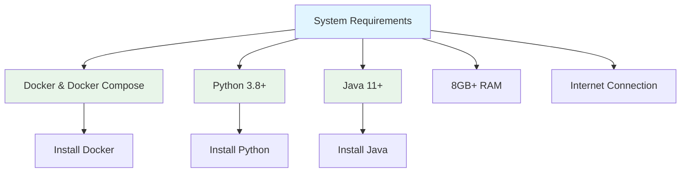
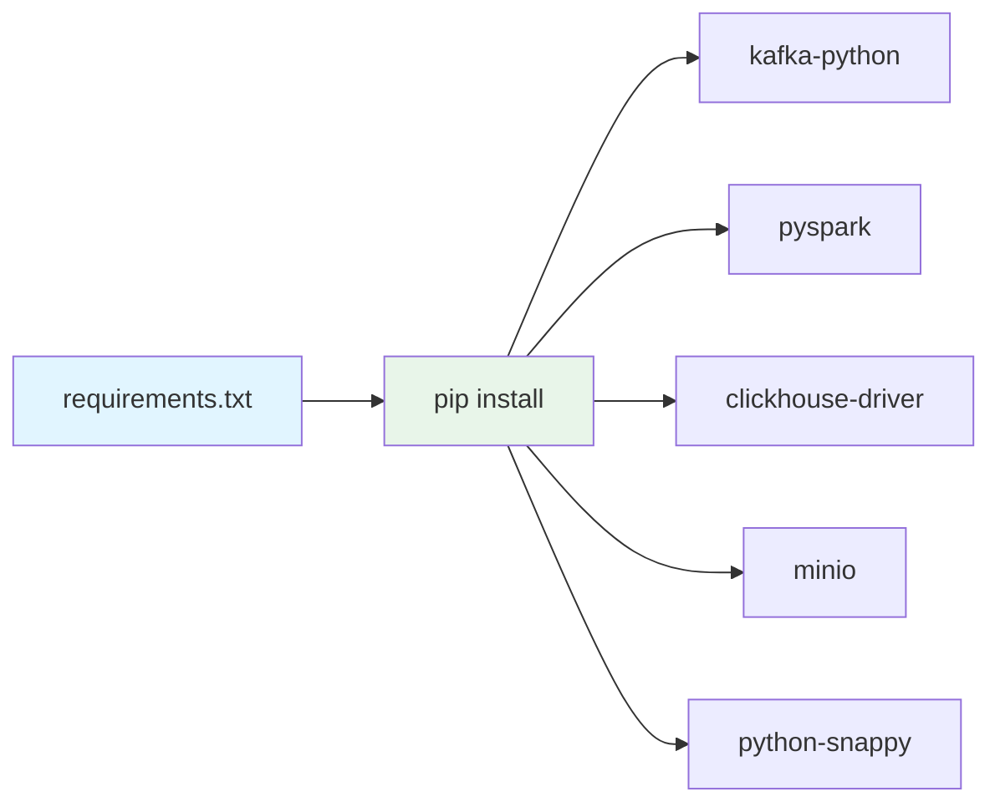
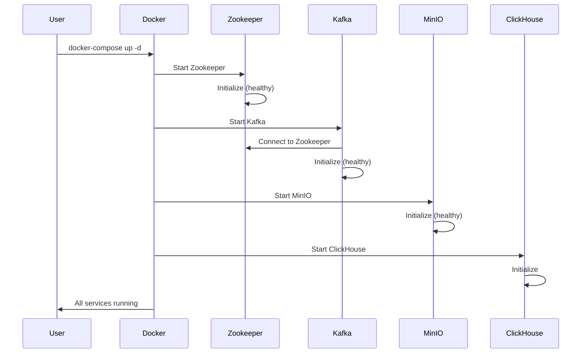
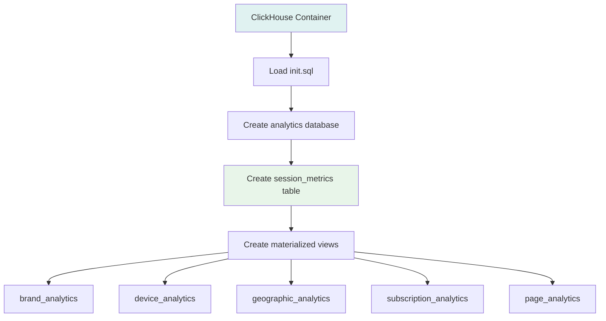
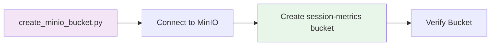
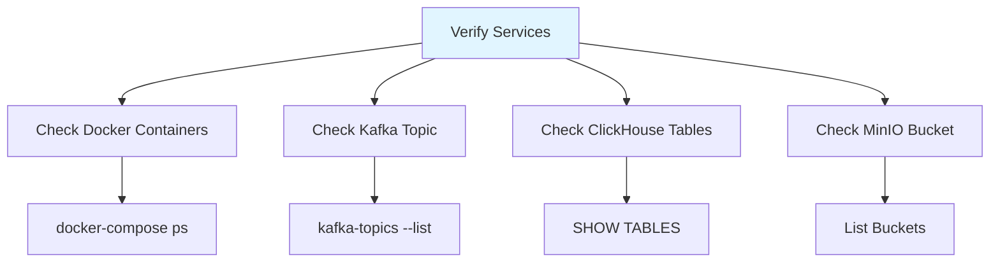
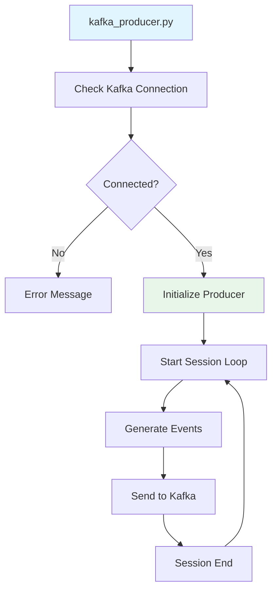
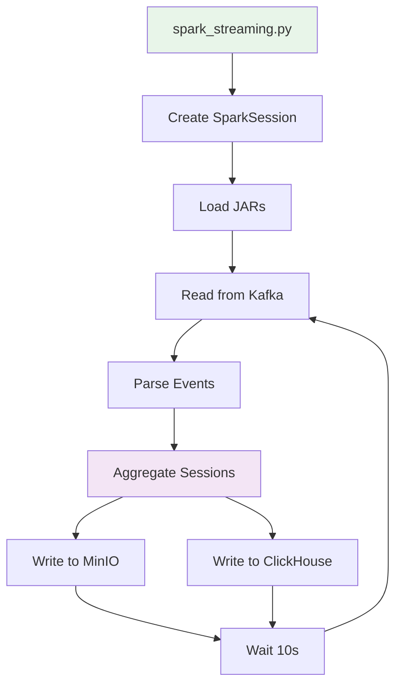
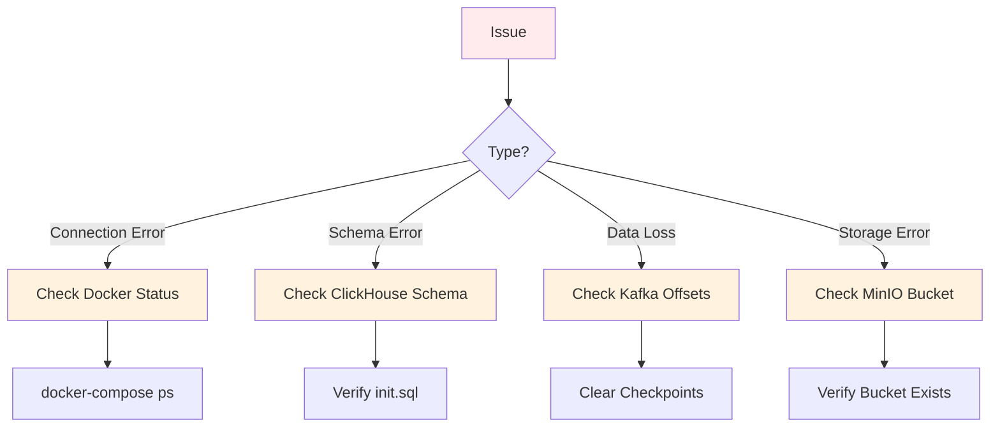

# Setup Guide

## Prerequisites



## Installation Steps

### Step 1: Clone Repository

```bash
git clone <repository-url>
cd backend/kafka_check
```

### Step 2: Install Python Dependencies



```bash
pip install -r requirements.txt
```

### Step 3: Start Infrastructure



```bash
docker-compose up -d
```

### Step 4: Initialize ClickHouse



```bash
docker exec -i clickhouse clickhouse-client --password clickhouse < clickhouse/init.sql
```

### Step 5: Create MinIO Bucket



```bash
python create_minio_bucket.py
```

### Step 6: Verify Setup



```bash
# Check containers
docker-compose ps

# Check Kafka topic
docker exec -it kafka_check-kafka-1 kafka-topics --list --bootstrap-server localhost:9092

# Check ClickHouse tables
docker exec -it clickhouse clickhouse-client --password clickhouse --query "SHOW TABLES FROM analytics"
```

## Running the Pipeline

### Start Kafka Producer



```bash
python kafka_producer.py
```

### Start Spark Streaming



```bash
python spark_streaming.py
```

## Verification

### Check Data in MinIO

```bash
python check_minio_data.py
```

### Check Data in ClickHouse

```bash
python check_clickhouse_data.py
```

## Troubleshooting



### Common Issues

1. **Kafka Connection Failed**
   - Ensure Docker containers are running
   - Check port 9092 is available

2. **ClickHouse Authentication Error**
   - Verify password in docker-compose.yml
   - Restart ClickHouse container

3. **MinIO Bucket Not Found**
   - Run `python create_minio_bucket.py`
   - Check MinIO console at http://localhost:9001

4. **Spark Checkpoint Error**
   - Clear checkpoint: `rm -rf /tmp/spark-checkpoints`
   - Set `failOnDataLoss: false` in spark_streaming.py

## Next Steps

After setup is complete, refer to:
- [Architecture Documentation](./architecture.md)
- [Data Flow Documentation](./data-flow.md)
- [Component Details](./components.md)

