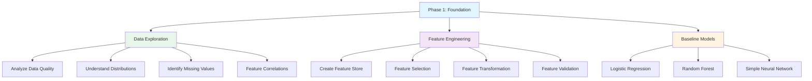
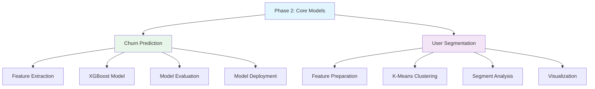
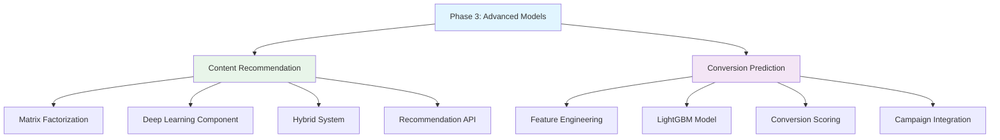
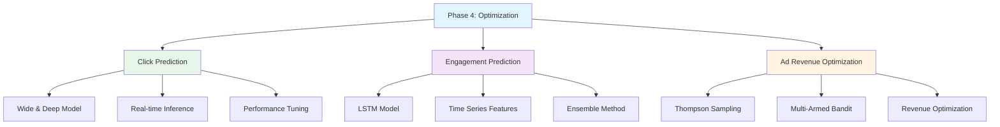
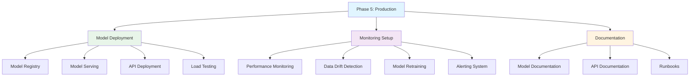
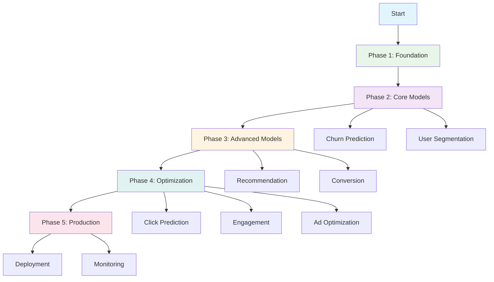
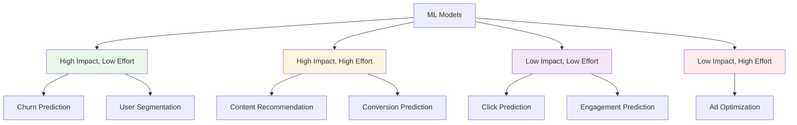
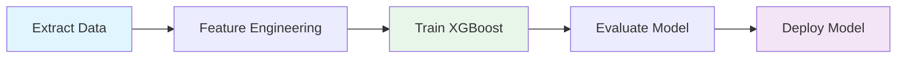
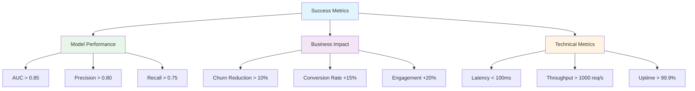

# ML Implementation Roadmap

## Overview

This roadmap guides the implementation of machine learning models for the Media Publishing real-time analytics pipeline, starting with the most impactful models and progressing systematically.

## Roadmap Structure

```mermaid
gantt
    title ML Implementation Roadmap
    dateFormat  YYYY-MM-DD
    section Phase 1: Foundation
    Data Exploration           :a1, 2025-11-06, 2d
    Feature Engineering        :a2, after a1, 3d
    Baseline Models            :a3, after a2, 2d
    section Phase 2: Core Models
    Churn Prediction           :b1, after a3, 5d
    User Segmentation          :b2, after b1, 3d
    section Phase 3: Advanced
    Content Recommendation     :c1, after b2, 7d
    Conversion Prediction      :c2, after b1, 5d
    section Phase 4: Optimization
    Click Prediction           :d1, after c2, 5d
    Engagement Prediction      :d2, after c1, 5d
    section Phase 5: Production
    Model Deployment           :e1, after d1, 3d
    Monitoring Setup           :e2, after e1, 2d
```

## Implementation Phases

### Phase 1: Foundation (Week 1)



**Tasks:**
1. ✅ Data exploration and quality checks
2. ✅ Feature engineering pipeline
3. ✅ Baseline model implementations
4. ✅ Evaluation metrics setup

**Deliverables:**
- `01_data_exploration.py` - Data analysis scripts
- `02_feature_engineering.py` - Feature engineering pipeline
- `03_baseline_models.py` - Baseline model implementations
- `requirements_ml.txt` - ML dependencies

### Phase 2: Core Models (Week 2-3)



**Tasks:**
1. ✅ Churn prediction model (XGBoost)
2. ✅ User segmentation (K-Means)
3. ✅ Model evaluation and validation
4. ✅ Model interpretation and insights

**Deliverables:**
- `04_churn_prediction.py` - Churn prediction model
- `05_user_segmentation.py` - User segmentation model
- `models/` - Trained model files
- `evaluation/` - Model evaluation reports

### Phase 3: Advanced Models (Week 4-5)



**Tasks:**
1. ✅ Content recommendation system
2. ✅ Subscription conversion prediction
3. ✅ Real-time inference setup
4. ✅ A/B testing framework

**Deliverables:**
- `06_recommendation_system.py` - Recommendation engine
- `07_conversion_prediction.py` - Conversion model
- `api/` - ML inference API
- `ab_testing/` - A/B testing framework

### Phase 4: Optimization (Week 6-7)



**Tasks:**
1. ✅ Click prediction model
2. ✅ Engagement prediction
3. ✅ Ad revenue optimization
4. ✅ Model performance optimization

**Deliverables:**
- `08_click_prediction.py` - Click prediction model
- `09_engagement_prediction.py` - Engagement model
- `10_ad_optimization.py` - Ad revenue optimization
- `optimization/` - Model optimization scripts

### Phase 5: Production (Week 8)



**Tasks:**
1. ✅ Model deployment pipeline
2. ✅ Monitoring and alerting
3. ✅ Model retraining automation
4. ✅ Production documentation

**Deliverables:**
- `deployment/` - Deployment scripts
- `monitoring/` - Monitoring dashboards
- `docs/` - Production documentation
- `runbooks/` - Operational runbooks

## Implementation Order



## Model Priority Matrix



## Quick Start Implementation

### Step 1: Setup Environment

```bash
# Navigate to ML directory
cd backend/kafka_check/ml

# Create ML environment (optional)
python -m venv ml_env
source ml_env/bin/activate  # or `ml_env\Scripts\activate` on Windows

# Install ML dependencies
pip install -r requirements_ml.txt
```

### Step 2: Run Data Exploration

```bash
# Explore the data
python 01_data_exploration.py
```

This will:
- Analyze data quality and distributions
- Extract user-level features
- Identify feature correlations
- Create `user_features_sample.csv`

### Step 3: Feature Engineering

```bash
# Create ML-ready features
python 02_feature_engineering.py
```

This will:
- Extract comprehensive user features
- Create churn and conversion labels
- Encode categorical features
- Generate derived features
- Save `user_features_ml_ready.csv`

### Step 4: Train First Model (Churn Prediction)

```bash
# Train churn prediction model
python 04_churn_prediction.py
```

This will:
- Train XGBoost model
- Evaluate model performance
- Save model and metrics
- Generate visualizations

## Data Access Example

```python
# Extract features from ClickHouse
from clickhouse_driver import Client

client = Client(host='localhost', port=9002, 
                database='analytics', user='default', 
                password='clickhouse')

# Get user features for ML
query = """
SELECT 
    user_id,
    count() as total_sessions,
    avg(session_duration_sec) as avg_duration,
    avg(total_events) as avg_events,
    avg(article_views) as avg_article_views,
    subscription_tier,
    country,
    device_type
FROM session_metrics
GROUP BY user_id, subscription_tier, country, device_type
"""

features = client.execute(query)
```

### Step 3: Start with Churn Prediction



## File Structure

```
ml/
├── README.md                    # ✅ This roadmap
├── requirements_ml.txt          # ✅ ML dependencies
├── run_all_ml_models.py        # ✅ Master script (run all models)
├── 01_data_exploration.py      # ✅ Data analysis
├── 02_feature_engineering.py   # ✅ Feature pipeline
├── 03_baseline_models.py       # ✅ Baseline implementations
├── 04_churn_prediction.py      # ✅ Churn model
├── 05_user_segmentation.py     # ✅ User segmentation
├── 06_recommendation_system.py # ✅ Recommendation engine
├── 07_conversion_prediction.py # ✅ Conversion model
├── 08_click_prediction.py      # ✅ Click prediction
├── 09_engagement_prediction.py  # ✅ Engagement model
├── 10_ad_optimization.py       # ✅ Ad optimization
├── utils/
│   ├── __init__.py             # ✅ Package init
│   └── data_loader.py          # ✅ Data loading utilities
├── models/                      # Created automatically
│   └── [trained models]         # Saved model files
└── [output files]              # CSV, PNG, JSON files
```

**Status:**
- ✅ All files created and ready to use
- 🚀 Ready for implementation

## Success Metrics



## Quick Start Commands

### Option 1: Run All Models Automatically (Recommended)

```bash
# 1. Install dependencies
cd backend/kafka_check/ml
pip install -r requirements_ml.txt

# 2. Run complete ML pipeline (from kafka_check directory)
cd ..
python run_ml.py
```

This will run all models in the correct order:
1. Data Exploration
2. Feature Engineering
3. Baseline Models
4. Churn Prediction
5. User Segmentation
6. Content Recommendation
7. Conversion Prediction
8. Click Prediction
9. Engagement Prediction
10. Ad Optimization

### Option 2: Run Models Individually

```bash
# 1. Install dependencies
pip install -r requirements_ml.txt

# 2. Explore data
python 01_data_exploration.py

# 3. Create features
python 02_feature_engineering.py

# 4. Train models individually
python 04_churn_prediction.py
python 05_user_segmentation.py
# ... etc
```

### Master Script Options

```bash
# Run complete pipeline (from kafka_check directory)
cd backend/kafka_check
python run_ml.py

# Skip data exploration (if already done)
python run_ml.py --skip-exploration

# Skip feature engineering (if already done)
python run_ml.py --skip-features

# Run only models (skip exploration and features)
python run_ml.py --models-only

# Skip prerequisite checks
python run_ml.py --skip-prerequisites
```

## Implementation Status

### ✅ Phase 1: Foundation (COMPLETE)
- ✅ Data exploration script (`01_data_exploration.py`)
- ✅ Feature engineering pipeline (`02_feature_engineering.py`)
- ✅ Baseline models (`03_baseline_models.py`)
- ✅ Data loading utilities (`utils/data_loader.py`)

### ✅ Phase 2: Core Models (COMPLETE)
- ✅ Churn prediction model (`04_churn_prediction.py`) - XGBoost
- ✅ User segmentation (`05_user_segmentation.py`) - K-Means

### ✅ Phase 3: Advanced Models (COMPLETE)
- ✅ Content recommendation (`06_recommendation_system.py`) - Hybrid (NMF + Content-Based)
- ✅ Conversion prediction (`07_conversion_prediction.py`) - LightGBM

### ✅ Phase 4: Optimization (COMPLETE)
- ✅ Click prediction (`08_click_prediction.py`) - XGBoost
- ✅ Engagement prediction (`09_engagement_prediction.py`) - XGBoost
- ✅ Ad optimization (`10_ad_optimization.py`) - Thompson Sampling

### ⏳ Phase 5: Production (TODO)
- ⏳ Model deployment API
- ⏳ Monitoring setup
- ⏳ Model retraining pipeline

## Next Steps

1. ✅ **Phase 1 Complete**: Run `01_data_exploration.py` and `02_feature_engineering.py`
2. ✅ **Phase 2 Complete**: Run `04_churn_prediction.py` and `05_user_segmentation.py`
3. ✅ **Phase 3 Complete**: Run `06_recommendation_system.py` and `07_conversion_prediction.py`
4. ✅ **Phase 4 Complete**: Run `08_click_prediction.py`, `09_engagement_prediction.py`, and `10_ad_optimization.py`
5. **Next**: Deploy models to production (create API, monitoring, etc.)

## Resources

- [Data Model Documentation](../docs/data-model.md) - Feature extraction guide
- [ML Models Documentation](../docs/ml-models.md) - Model recommendations
- [Architecture Documentation](../docs/architecture.md) - System architecture
- [API Reference](../docs/api-reference.md) - Data access patterns

## Timeline

- **Week 1**: Foundation (Data exploration, feature engineering) ✅
- **Week 2-3**: Core Models (Churn ✅, Segmentation ✅) ✅
- **Week 4-5**: Advanced Models (Recommendation ✅, Conversion ✅) ✅
- **Week 6-7**: Optimization (Click ✅, Engagement ✅, Ad ✅) ✅
- **Week 8**: Production (Deployment ⏳, Monitoring ⏳)

**All ML models implemented!** 🎉  
Run the commands above to start training and using the models. 🚀

## Model Summary

| Model | File | Algorithm | Status |
|-------|------|-----------|--------|
| Baseline Models | `03_baseline_models.py` | Logistic Regression, Random Forest, Neural Network | ✅ |
| Churn Prediction | `04_churn_prediction.py` | XGBoost | ✅ |
| User Segmentation | `05_user_segmentation.py` | K-Means Clustering | ✅ |
| Content Recommendation | `06_recommendation_system.py` | Hybrid (NMF + Content-Based) | ✅ |
| Conversion Prediction | `07_conversion_prediction.py` | LightGBM | ✅ |
| Click Prediction | `08_click_prediction.py` | XGBoost | ✅ |
| Engagement Prediction | `09_engagement_prediction.py` | XGBoost | ✅ |
| Ad Optimization | `10_ad_optimization.py` | Thompson Sampling | ✅ |

